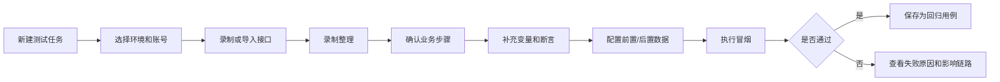

# 接口链路执行能力改进 - 总体设计

## 1. 文档目的

本文用于评审当前平台的产品交互和能力设计，目标不是增加更多按钮，而是解决以下实际问题：

1. 录制后接口太多，测试人员不知道哪些该保留。
2. 节点全部纵向排列，节点数量较多时画布不可读。
3. 页面菜单太多，新用户不知道先做什么。
4. 登录、查询、创建数据等公共步骤重复配置。
5. 复杂链路无法拆分，全部堆在一张大画布上。
6. 测试数据、环境、账号分散管理，回归用例容易失效。
7. 失败只能看到某个节点失败，不能快速知道失败原因和影响范围。

本文基于当前代码设计，不改变现有技术栈，默认前端为 `frontend/`。

## 2. 当前实现事实

### 2.1 画布现状

当前链路页面使用 AntV X6：

- 画布入口：`auto-test/frontend/src/views/ChainEdit.vue`
- 图实例：`auto-test/frontend/src/graph/graph.js`
- 节点宽度：220px
- 节点高度：76px
- 无画布数据时，按 `i % 4` 生成 4 列节点
- 自动布局按 DAG 层级从左到右排列，同一层节点纵向堆叠

当前默认布局代码在 `ChainEdit.vue` 的 `renderCanvas` 和 `graph.js` 的 `autoLayout` 中。它没有按照浏览器可视区域计算列数，也没有针对线性录制链路做蛇形布局。

### 2.2 录制现状

当前插件：

- `background.js` 将请求保存到 `chrome.storage.local.recordedApis`
- `sidepanel.js` 的 `render()` 按 `bizOperTraceId` 分组展示
- `doPush()` 将选中请求转换为 `interfaceList` 推送
- 已有静态资源、请求类型、状态、关键词过滤

问题是：过滤主要发生在请求层面，用户仍然需要在推送前判断“这个请求是不是本次业务操作的一部分”。当前没有正式的“录制整理”步骤，也没有对重复请求、轮询请求、依赖关系给出清晰解释。

### 2.3 导航现状

当前系统同时展示链路、执行、数据池、账号、定时任务、分类、系统配置、租户、产品等菜单。它们是管理能力，不应全部作为新手的第一层工作入口。

## 3. 设计原则

### 3.1 简单模式不增加复杂度

普通测试人员只看到：

```text
录制/导入 -> 整理接口 -> 补充断言 -> 执行 -> 查看失败
```

高级能力默认折叠，不把 MQ、脚本、环境、数据清理等技术概念直接放在主流程上。

### 3.2 显示布局和执行顺序分离

画布怎么摆只影响阅读，不改变执行顺序。执行顺序仍然以 X6 的边和后端 DAG 为准。

### 3.3 复杂能力优先包装成业务动作

不让用户配置“轮询节点 + 条件节点 + 跳转节点”，而是提供：

```text
等待订单状态变为：已支付
```

系统内部再生成轮询和判断逻辑。

### 3.4 先解决高频问题

第一阶段只做接口回归最常用的能力：录制整理、蛇形布局、环境、前后置数据、公共链路、失败分析。MQ 和脚本作为扩展能力，不在第一阶段强行加入主界面。

## 4. 总体用户流程



第一次使用时，系统只要求用户完成 A 到 H。环境、账号、数据池等没有配置时，不阻断普通接口调试，但在保存为回归用例时提示补全。

## 5. 画布布局设计

### 5.1 设计结论

采用“**自适应蛇形布局**”作为线性录制链路的默认布局；采用“**DAG 分层布局 + 层内折行**”作为有分支链路的默认布局。

不采用单列布局，也不采用无限横向布局。

### 5.2 线性链路的蛇形布局

节点按执行顺序编号，从左到右、从上到下排列；每一行方向交替：

```text
01 -> 02 -> 03 -> 04 -> 05
                              |
10 <- 09 <- 08 <- 07 <- 06
|
11 -> 12 -> 13 -> 14 -> 15
```

这样 100 个节点在 5 列时约为 20 行，不会形成一条几千像素高的单列画布。

### 5.3 列数计算

画布初始化和点击“自动布局”时计算：

```text
availableWidth = 画布容器宽度 - 左右边距
columnCount = floor(availableWidth / (nodeWidth + horizontalGap))
columnCount = clamp(columnCount, 2, 6)
```

建议参数：

```text
nodeWidth = 220
nodeHeight = 76
horizontalGap = 36
verticalGap = 48
leftPadding = 60
topPadding = 60
```

示例：

| 画布宽度 | 默认列数 | 100 节点大约行数 |
|---|---:|---:|
| 900px | 3 | 34 |
| 1280px | 5 | 20 |
| 1920px | 6 | 17 |

浏览器缩放不会改变节点尺寸，只重新计算节点位置。

### 5.4 蛇形布局算法

```text
for index in 0..nodes.length-1:
    row = floor(index / columnCount)
    offset = index % columnCount
    column = row 为偶数 ? offset : columnCount - 1 - offset
    x = leftPadding + column * (nodeWidth + horizontalGap)
    y = topPadding + row * (nodeHeight + verticalGap)
```

连线使用 Manhattan 路由。蛇形转向位置增加一个中间转折点，避免连线穿过节点。

### 5.5 DAG 链路布局

有分支时不能单纯按编号蛇形排列，采用以下规则：

1. 根据入度计算 DAG 层级。
2. 每一层最多摆 `maxNodesPerColumn` 个节点。
3. 超过数量时，同一层内部向下扩展，不把其他层挤成一列。
4. 同一层节点按原始执行序号排序。
5. 布局后仍保留所有边，执行计划不读取节点坐标。

### 5.6 画布交互

工具栏保留以下按钮：

```text
适应屏幕 | 蛇形布局 | DAG布局 | 小地图 | 搜索节点
```

新增：

- 节点数量超过 30 时，进入页面自动使用蛇形布局。
- 节点数量超过 80 时，左侧显示“第 1-20 步 / 共 100 步”的范围提示。
- 点击左侧节点列表时，画布居中到节点并高亮上下游节点。
- 不自动保存布局，用户点击“保存画布”后才保存坐标。

### 5.7 代码落点

| 文件 | 改动 |
|---|---|
| `frontend/src/graph/graph.js` | 新增 `snakeLayout(graph, options)` 和 `dagWrapLayout(graph, options)` |
| `frontend/src/views/ChainEdit.vue` | 根据容器宽度计算列数，新增布局切换和自动适应 |
| `frontend/src/components/x6/HttpNode.vue` | 显示步骤编号、状态、变量标记 |
| `frontend/src/api/chain.js` | 可选增加布局保存字段；第一版可继续复用 `graphData` |

## 6. 菜单和新手流程设计

### 6.1 一级菜单只保留四项

```text
工作台
测试资产
执行结果
系统管理
```

二级菜单：

```text
工作台：开始测试、最近执行、待处理失败

测试资产：测试链路、公共组件、数据池、测试账号

执行结果：执行记录、定时任务、失败分析

系统管理：用户、租户、分类、系统配置、插件下载
```

产品、租户、分类等管理项不删除，只放入“系统管理”。

### 6.2 工作台显示任务步骤

首页不展示功能介绍，而展示一个可操作的步骤清单：

```text
1. 选择测试系统和环境       未完成
2. 录制或导入接口             未完成
3. 整理接口并生成链路         未完成
4. 配置变量和断言             未完成
5. 执行一次冒烟测试           未完成
6. 保存为回归用例             未完成
```

每一步只有一个主按钮，例如“开始录制”“整理录制结果”“去配置断言”。

### 6.3 首次使用流程

用户首次登录后进入“开始测试”页面，不进入空的链路列表。页面提供两个入口：

```text
我已经有接口数据 -> 导入 cURL / Swagger / JSON
我还没有接口数据 -> 安装插件并开始录制
```

完成一步后自动进入下一步。用户可以跳过高级配置，但不能在没有节点的情况下直接进入执行。

### 6.4 代码落点

| 文件 | 改动 |
|---|---|
| `frontend/src/App.vue` | 调整一级菜单和侧边栏分组 |
| `frontend/src/router/index.js` | 增加 `/workbench` 和 `/workbench/start` |
| `frontend/src/views/WorkBench.vue` | 新增步骤清单和最近任务 |
| `frontend/src/components/OnboardingChecklist.vue` | 记录每个链路的完成状态 |
| `frontend/src/views/ChainList.vue` | 增加“继续配置”入口 |

## 7. 录制整理和用例生成

### 7.1 整理页位置

不放在平台链路编辑页，放在插件“推送至平台”之前：

```text
开始录制 -> 停止录制 -> 录制整理 -> 推送到平台
```

原因：此时用户最清楚刚才做了什么操作。

### 7.2 自动分类规则

每条请求增加以下字段：

```json
{
  "captureCategory": "BUSINESS",
  "captureReason": "用户操作窗口内的POST请求",
  "selected": true,
  "duplicateKey": "POST /api/order",
  "traceStep": 3
}
```

分类规则第一版只做可解释规则：

- `BUSINESS`：窗口内的 Fetch/XHR，且不是静态资源、埋点、OPTIONS
- `POLLING`：相同 URL 短时间重复出现，且响应结构无变化
- `NOISE`：静态资源、埋点、心跳、OPTIONS
- `DUPLICATE`：方法、URL、请求体相同的重复请求
- `UNKNOWN`：无法判断，默认不选中

界面必须显示原因，不能只显示一个“AI推荐”。

### 7.3 整理页操作

顶部：

```text
推荐保留 8 条 | 全选业务接口 | 删除重复 | 仅显示待确认
```

每组操作显示：

```text
第 1 步：点击“查询”
├─ POST /api/login        已选中
├─ GET  /api/user          已选中
└─ GET  /api/track         已忽略：埋点
```

测试人员只需要确认推荐结果，并修改节点名称，不需要理解 traceId。

### 7.4 生成用例规则

推送时自动生成：

- 节点名称：优先使用接口摘要，其次使用 URL 最后一级路径
- 同一操作窗口生成一个业务分组
- 相邻请求自动连线
- 前一个响应中被后一个请求引用的字段，生成变量提取建议
- 无法确认的变量只提示，不自动写入断言

## 8. 后续详细设计

公共组件、环境/账号/数据、失败分析、变更影响、实施顺序和验收标准见：

`02-详细设计与实施任务.md`
