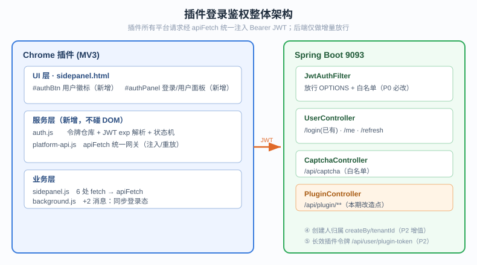
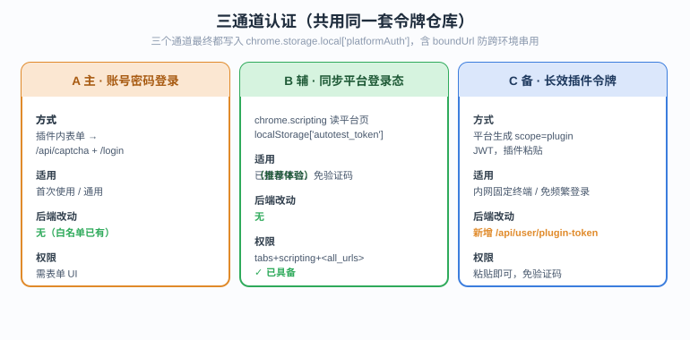
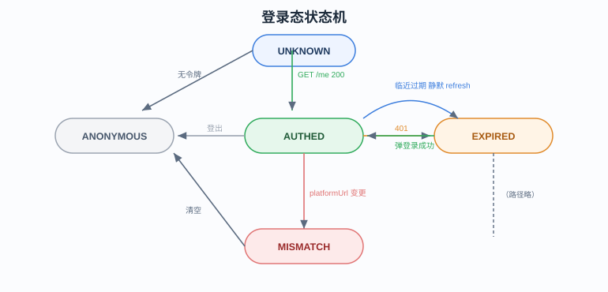
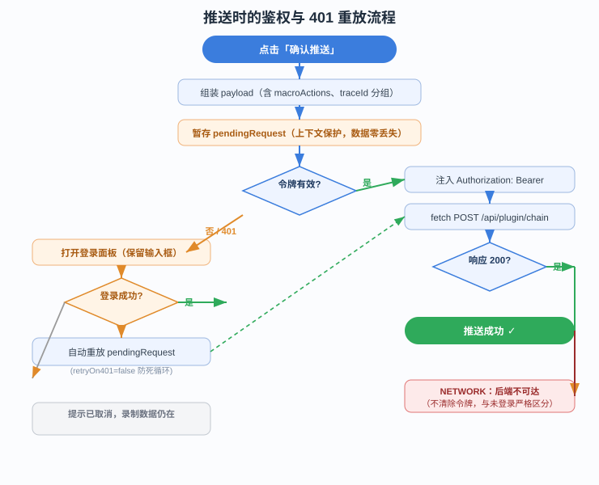

# 浏览器插件登录鉴权架构设计

> 版本：v1.0　日期：2026-08-03　范围：plugin-test（捉接口 TraceFlow）+ backend（auto-test）

---

## 一、问题定位

### 1.1 现象

插件侧边栏点击「确认推送」后弹出 `失败: 未登录或登录已过期`。

### 1.2 根因链路

| 环节 | 现状 | 结论 |
|------|------|------|
| 插件推送 | `sidepanel.js:1084` 裸 `fetch(url, { headers: { 'Content-Type': 'application/json' } })` | 无 `Authorization` 头 |
| 后端拦截 | `WebMvcConfig` 对 `/api/**` 全量挂 `JwtAuthFilter`，仅放行 `/api/user/login`、`/api/captcha`、`/api/sso/*` | `/api/plugin/**` 被拦截 |
| 拦截响应 | `JwtAuthFilter:27-30` 返回 `{"code":401,"message":"未登录或登录已过期"}` | 插件读到 `d.message` 后 alert |

即：平台引入登录后，插件是**唯一没有身份**的客户端。

### 1.3 受影响的插件调用点（共 6 处）

| 位置 | 接口 | 用途 |
|------|------|------|
| `sidepanel.js:414` | `GET /api/plugin/chain/list` | 链路管理列表 |
| `sidepanel.js:481` | `GET /api/chain/versions` | 版本列表 |
| `sidepanel.js:565` | `GET /api/plugin/chain/detail` | 回放取链路详情 |
| `sidepanel.js:692` | `GET /api/plugin/chain/detail` | 链路详情查看 |
| `sidepanel.js:1080` | `POST /api/plugin/chain/create\|append` | **推送（当前报错点）** |
| 预留 | `POST /api/plugin/chain/replay/push` | 回放结果回传 |

> 注意：`sidepanel.js:629` 与 `:871` 的 `fetch` 是**回放被测系统接口**，属业务流量，不得附加平台 JWT。

---

## 二、设计目标

### 2.1 目标

1. **插件自持身份**：不依赖平台页面即可独立登录，获取并持有平台 JWT。
2. **登录态复用**：已在浏览器登录过平台的用户，一键同步登录态，免二次输入验证码。
3. **统一收口**：所有平台请求经单一网关函数，集中处理令牌注入、过期预检、401 兜底。
4. **上下文不丢失**：鉴权失败时暂存原请求，登录成功后自动重放，已录制数据零丢失。
5. **最小侵入**：后端仅做增量改动，不破坏前端 Vue 与现有 SSO 逻辑。
6. **内网可用**：不引入任何外部 CDN / 三方依赖，契合 `内网部署改动清单.md` 的离线要求。

### 2.2 非目标（本期不做）

- 插件端的用户管理、注册、改密（统一在平台前端完成）。
- WebSocket（`/ws/execute/{id}`）鉴权 —— 插件当前不使用，列入演进项。
- 按租户 / 用户的数据可见性隔离 —— 需数据库与业务层配套，独立立项。

---

## 三、总体架构

### 3.1 分层

```
┌── Chrome 插件 (MV3) ─────────────────────────────────────┐
│                                                          │
│  UI 层     sidepanel.html                                │
│            ├─ #authBtn        顶栏用户徽标（新增）        │
│            └─ #authPanel      登录 / 用户面板（新增）     │
│                                                          │
│  服务层    auth.js            令牌仓库 + 状态机（新增）   │
│            platform-api.js    apiFetch 统一网关（新增）   │
│                                                          │
│  业务层    sidepanel.js       6 处 fetch 改为 apiFetch    │
│            background.js      +2 条消息：同步登录态       │
│                                                          │
└──────────────────────────────────────────────────────────┘
                    │ Authorization: Bearer <JWT>
                    ▼
┌── Spring Boot 9093 ──────────────────────────────────────┐
│  JwtAuthFilter    放行 OPTIONS + 白名单                   │
│  UserController   /login（已有）· /me · /refresh（新增）  │
│  CaptchaController /api/captcha（已有，白名单）           │
│  PluginController 从 request 取 userId → 写 createBy      │
└──────────────────────────────────────────────────────────┘
```



### 3.2 职责边界

| 模块 | 职责 | 明确不做 |
|------|------|----------|
| `auth.js` | 令牌读写、JWT `exp` 解析、状态机、storage 同步 | 不发网络请求 |
| `platform-api.js` | URL 拼装、令牌注入、401 拦截、请求重放、错误归一 | 不操作 DOM |
| `sidepanel.js` | 业务编排、UI 渲染 | 不直接拼 `Authorization` |
| `background.js` | 跨标签页读取平台 `localStorage` | 不缓存令牌 |

---

## 四、认证方式选型

采用「主 + 辅 + 备」三通道，**共用同一套令牌仓库**。

| 通道 | 方式 | 适用场景 | 后端改动 |
|------|------|----------|----------|
| **A 主：账号密码登录** | 插件内表单，调 `/api/captcha` + `/api/user/login` | 通用，首次使用 | 无 |
| **B 辅：同步平台登录态** | `chrome.scripting.executeScript` 读取平台页 `localStorage['autotest_token']` | 已在浏览器登录过平台，免验证码 | 无 |
| **C 备：长效插件令牌** | 平台生成 `scope=plugin` 的长效 JWT，插件粘贴 | 内网固定终端、免频繁登录 | 需新增接口 |



### 4.1 通道 A：账号密码登录

复用平台既有契约，零后端改动：

```
GET  /api/captcha
  ← { code:200, data:{ token, image(dataURL), expireSeconds:60 } }

POST /api/user/login
  → { username, password, captcha, captchaToken }
  ← { code:200, data:{ token, user:{ id, username, displayName, role, tenantId, status } } }
```

要点：
- 验证码图片是 base64 dataURL，直接 ``，**无外部依赖，内网可用**。
- 验证码 60 秒过期且一次性消费，登录失败后必须自动重新拉取。
- 密码强度策略（`PasswordValidator`）只在创建/改密时生效，登录不校验，插件端无需引入。

### 4.2 通道 B：同步平台登录态（推荐体验路径）

平台前端把令牌存在 `localStorage['autotest_token']`（见 `frontend/src/utils/auth.js`）。插件已具备 `tabs` + `scripting` + `<all_urls>` 权限，可直接读取：

```js
// background.js 新增
async function syncTokenFromPlatform(frontendUrl) {
  const origin = new URL(frontendUrl).origin;
  const tabs = await chrome.tabs.query({ url: origin + '/*' });
  if (!tabs.length) return { ok: false, reason: 'NO_TAB' };
  const [{ result }] = await chrome.scripting.executeScript({
    target: { tabId: tabs[0].id },
    func: () => ({
      token: localStorage.getItem('autotest_token'),
      user: localStorage.getItem('autotest_user')
    })
  });
  return result && result.token ? { ok: true, ...result } : { ok: false, reason: 'NO_TOKEN' };
}
```

失败降级提示：
- `NO_TAB` → 「请先在浏览器打开并登录平台页面」，并提供跳转按钮。
- `NO_TOKEN` → 「平台页面尚未登录」。

### 4.3 通道 C：长效插件令牌（可选，内网友好）

```
POST /api/user/plugin-token   （需已登录）
  → { remark:"张三的工作机", days:180 }
  ← { code:200, data:{ token, expireAt } }
```

实现：`JwtUtil.generateToken(userId, username, role, tenantId, ttlMs, scope)`，claim 增加 `scope=plugin`。后端可按 `scope` 限制该令牌只能访问 `/api/plugin/**`，缩小泄露面。

---

## 五、关键契约

### 5.1 存储结构（`chrome.storage.local`）

```jsonc
{
  "platformAuth": {
    "token": "eyJhbGciOiJIUzI1NiJ9...",
    "tokenType": "user",              // user | plugin | synced
    "user": { "id": 1, "username": "admin", "displayName": "管理员",
              "role": "ADMIN", "tenantId": null },
    "exp": 1754300000000,             // 毫秒，由 JWT payload.exp * 1000 解析
    "loginAt": 1754213600000,
    "boundUrl": "http://localhost:9093"  // 绑定的后端地址，防止跨环境串用
  }
}
```

设计约束：
- **与 `settings` 分离存储**。修改 `platformUrl` 时若与 `boundUrl` 不一致，立即清空 `platformAuth` 并提示重新登录 —— 这是内网/外网双环境切换的关键防呆。
- **不存密码**，只存令牌。
- 多个 sidepanel 实例通过 `chrome.storage.onChanged` 监听 `platformAuth` 实时同步登录态。

### 5.2 `auth.js` 对外 API

```js
window.PlatformAuth = {
  get(),                  // → authObj | null
  set(authObj),           // 写入 + 广播
  clear(),                // 登出
  isValid(skewMs = 300000), // 本地判定：存在且距 exp 还有 >5 分钟
  parseExp(jwt),          // base64url 解码 payload.exp（只读不验签）
  getState(),             // ANONYMOUS | AUTHED | EXPIRED | MISMATCH
  onChange(cb)            // 订阅变更
};
```

> `parseExp` 仅做本地预检以减少无效请求，**权威校验始终在后端**，不构成安全依赖。

### 5.3 `platform-api.js` 网关契约

```js
apiFetch(path, options)
// options: { method, body, query, auth = true, retryOn401 = true, silent = false }
// return : Promise<{ code, message, data }>
// throw  : { type: 'NO_BASE_URL' | 'NETWORK' | 'UNAUTHORIZED' | 'BIZ', message }
```

执行顺序：

1. 取 `settings.platformUrl`，为空 → 抛 `NO_BASE_URL`，引导去设置面板。
2. `auth === true` 时校验 `PlatformAuth.isValid()`；无效则先走登录流程（见 6.2）。
3. 注入 `Authorization: Bearer <token>` 与 `Content-Type`。
4. `fetch` 异常（`Failed to fetch`）→ 抛 `NETWORK`，提示"后端不可达，请检查地址与服务状态"，**与"未登录"严格区分**。
5. HTTP `401 / 403` 或响应体 `code === 401` → `PlatformAuth.clear()`；若 `retryOn401` 则暂存请求、打开登录面板，登录成功后**自动重放一次**（重放请求强制 `retryOn401 = false`，防止死循环）。
6. 其它 `code !== 200` → 抛 `BIZ`，携带后端 message。

### 5.4 状态机

```
        启动 / 打开面板
             │
             ▼
      ┌─ UNKNOWN ─┐
      │           │  GET /api/user/me
      ▼           ▼
  ANONYMOUS    AUTHED ──── exp 临近 ──▶ 静默 refresh ──▶ AUTHED
      ▲           │
      │           ├── 后端 401 ─────▶ EXPIRED ──▶ 弹登录 ──▶ AUTHED
      │           │
      │           └── 用户登出 ──────┐
      └────────────────────────────┘
              platformUrl 变更 ──▶ MISMATCH ──▶ 清空 ──▶ ANONYMOUS
```



---

## 六、核心流程

### 6.1 启动探活

侧边栏 `init()` 中追加：本地有令牌 → `GET /api/user/me`（`retryOn401=false, silent=true`）。
- 200 → 刷新用户信息，徽标显示已登录。
- 401 → 静默清除，徽标显示未登录红点。**不弹窗打扰**，等到真正操作时再引导登录。

### 6.2 推送时的鉴权（对应流程图）

```
点击「确认推送」
  → 组装 payload（含 macroActions、traceId 分组）
  → 暂存 pendingRequest = { path, options }        ← 关键：上下文保护
  → apiFetch(...)
      ├─ 令牌有效 → 带 JWT 请求 → 200 → 推送成功
      └─ 无令牌 / 过期 / 401
            → 打开登录面板（保留推送弹窗的输入值）
            → 登录成功 → 自动重放 pendingRequest → 推送成功
            → 用户取消 → 提示"已取消登录，推送未执行"，录制数据仍在
```



**多分组推送的特殊处理**：`doPush` 在多 traceId 时会串行推送 N 条链路。设计为：
- 推送前**统一做一次** `ensureLogin()`，避免中途弹 N 次登录框；
- 串行过程中若某条仍返回 401，中止后续推送并汇总提示，已成功的链路编码照常展示。

### 6.3 令牌续期

JWT 有效期 24 小时（`JwtUtil.EXPIRATION_MS`）。策略：
- 距过期 < 30 分钟且用户有操作 → 静默调 `POST /api/user/refresh` 换新令牌。
- refresh 失败不打断当前操作，降级为下次 401 时重登。

### 6.4 环境切换防呆

保存设置时比对 `settings.platformUrl` 与 `platformAuth.boundUrl`：不一致则清空登录态并提示「已切换后端环境，请重新登录」。避免把内网令牌发到外网地址（反之亦然）。

---

## 七、后端改动清单

### 7.1 必改（P0）

**① `JwtAuthFilter` 放行预检请求**

```java
if ("OPTIONS".equalsIgnoreCase(request.getMethod())) {
    return true;
}
```

原因：Spring MVC 在预检（preflight）时仍会执行自定义拦截器链，`OPTIONS` 不带 `Authorization` 必然 401。当前插件因扩展页 `host_permissions` 豁免了预检才侥幸没暴露，但一旦经 nginx 反代、或改由 content script 发起请求就会立刻失败。

**② 区分 401 的两种语义**（便于插件精准提示）

```java
// 缺令牌
{"code":401,"message":"未登录，请先登录平台","reason":"NO_TOKEN"}
// 令牌失效
{"code":401,"message":"登录已过期，请重新登录","reason":"TOKEN_EXPIRED"}
```

### 7.2 建议增（P1）

**③ `UserController` 新增两个接口**

```java
@GetMapping("/me")
public Result<?> me(HttpServletRequest req) {
    Long userId = (Long) req.getAttribute("userId");   // 由拦截器写入
    return Result.success(userService.getUserById(userId));
}

@PostMapping("/refresh")
public Result<?> refresh(HttpServletRequest req) {
    Long userId = (Long) req.getAttribute("userId");
    return Result.success(userService.refreshToken(userId));
}
```

两者均**走拦截器**（不加白名单），天然实现"探活"语义。

### 7.3 增值项（P2）

**④ 推送写入创建人归属**

`TestChain` 已有 `createBy`、`tenantId` 字段，但 `PluginController` 未填充。登录改造后可顺带补齐：

```java
@PostMapping("/chain/create")
public Result<?> createChainByPlugin(@Valid @RequestBody PluginChainCreateDTO dto,
                                     HttpServletRequest req) {
    dto.setCreateBy((String) req.getAttribute("username"));
    dto.setTenantId((Long) req.getAttribute("tenantId"));
    ...
}
```

这是登录改造带来的直接收益：**链路可追溯到人**，为后续按人/租户过滤打基础。

**⑤ 长效插件令牌** `POST /api/user/plugin-token`（见 4.3）。

---

## 八、UI 设计

### 8.1 顶栏用户徽标

位置：`sidepanel.html` 的 `.header-actions` 内、`#goPlatformBtn` 之前。

| 状态 | 呈现 |
|------|------|
| 未登录 | 灰色人像图标 + 右上角红点 |
| 已登录 | 圆形徽标显示用户名首字，hover 提示 `displayName (role)` |
| 已过期 | 黄色人像图标 + 感叹号 |

### 8.2 登录 / 用户面板 `#authPanel`

完全复用现有 `.panel` / `.panel-hd` / `.panel-bd` / `.form-g` 样式与 `openP/closeP` 逻辑，零新增 CSS 框架。

**未登录态**：后端地址（与设置联动）→ 用户名 → 密码 → 验证码（图片可点击刷新）→ 登录按钮 → 「从平台同步登录态」次要按钮。

**已登录态**：用户名 / 角色 / 租户 / 令牌到期时间 → 「退出登录」→「切换账号」。

### 8.3 推送按钮态

`#pushBtn` 在未登录时**不禁用**（禁用会让用户困惑），保持可点击，点击后由 `apiFetch` 引导登录 —— 符合"在用户表达意图的那一刻才要求身份"的原则。

---

## 九、异常与边界

| 场景 | 处理 |
|------|------|
| 未配置 `platformUrl` | 抛 `NO_BASE_URL`，直接打开设置面板并聚焦输入框 |
| 后端不可达 | 提示"无法连接后端 {url}"，**不清除令牌** |
| 验证码过期/错误 | 后端返回 400，自动刷新验证码图片并聚焦 |
| 账号被禁用 | 后端 403「账号已被禁用」，原样透传，不进入重登循环 |
| 令牌被平台端登出 | 下次请求 401 → 走标准重登流程 |
| 多个 sidepanel 窗口 | `storage.onChanged` 广播，各窗口徽标同步 |
| 插件重装/升级 | 同私钥打包时 `chrome.storage` 保留，登录态延续 |
| 回放被测系统接口 | `sidepanel.js:629 / :871` 保持裸 `fetch`，**严禁注入平台 JWT** |
| 401 重放死循环 | 重放请求强制 `retryOn401 = false` |

---

## 十、安全考量

| 项 | 评估 |
|----|------|
| 令牌存储 | `chrome.storage.local` 明文，仅本机、仅本扩展可读，风险等同浏览器 localStorage；不存密码 |
| 令牌作用域 | 通道 C 的 `scope=plugin` 可限制仅访问 `/api/plugin/**`，建议内网长效场景启用 |
| 传输 | 内网 HTTP 明文，与平台前端同等风险；有条件时前置 HTTPS |
| 环境串用 | `boundUrl` 绑定校验，杜绝内网令牌发往外网 |
| JWT 密钥 | `JwtUtil.SECRET_KEY = "auto-test-jwt-secret-key-2026"` 硬编码且已进版本库，**建议外置到配置并更换**（与 `内网部署改动清单.md` 中的安全项一并处理） |
| 日志 | `console.log` 严禁打印完整令牌，只打印前 8 位 |

---

## 十一、文件改动清单

### 插件端

| 文件 | 类型 | 说明 |
|------|------|------|
| `plugin-test/auth.js` | **新增** ≈120 行 | 令牌仓库、`exp` 解析、状态机 |
| `plugin-test/platform-api.js` | **新增** ≈130 行 | `apiFetch` 网关、401 重放、错误归一 |
| `plugin-test/sidepanel.html` | 改 | 顶栏 `#authBtn`；新增 `#authPanel` 与 `#authOverlay`；`<script>` 引入两个新文件（置于 `sidepanel.js` 之前） |
| `plugin-test/sidepanel.js` | 改 | 6 处 `fetch` → `apiFetch`；新增 `openAuthPanel / doLogin / doLogout / refreshCaptcha / syncFromPlatform / renderAuthBadge`；`init()` 加探活 |
| `plugin-test/background.js` | 改 | 新增消息 `SYNC_PLATFORM_TOKEN`、`GET_AUTH_STATE` |
| `plugin-test/manifest.json` | 改 | version → `1.2.0`（权限已足够，无需新增） |

> `sidepanel.js` 现 1203 行，逼近编码规范 400/500 行上限。本次改造**不再向其堆砌鉴权逻辑**，而是外置为两个独立文件，符合"模块隔离、职责单一"的项目规范。

### 后端

| 文件 | 类型 | 说明 |
|------|------|------|
| `filter/JwtAuthFilter.java` | 改 | 放行 `OPTIONS`；401 增加 `reason` 字段 |
| `controller/UserController.java` | 改 | 新增 `/me`、`/refresh` |
| `service/UserService(Impl).java` | 改 | 新增 `refreshToken(userId)` |
| `util/JwtUtil.java` | 改（P2） | `generateToken` 增加 `ttl` / `scope` 重载 |
| `controller/PluginController.java` | 改（P2） | 从 request attribute 取 `userId/username/tenantId` |
| `model/dto/PluginChainCreateDTO.java` | 改（P2） | 增加 `createBy`、`tenantId` 字段 |

---

## 十二、分阶段落地

| 阶段 | 内容 | 产出 |
|------|------|------|
| **P0 打通** | `auth.js` + `platform-api.js` + 登录面板 + 6 处调用改造；后端放行 `OPTIONS` | 推送恢复可用 |
| **P1 体验** | `/me` 探活 + `/refresh` 续期 + 顶栏徽标 + 环境切换防呆 | 登录态稳定、少打扰 |
| **P2 增强** | 同步平台登录态 + 长效插件令牌 + 创建人归属写入 | 免验证码、链路可追溯 |
| **P3 演进** | WebSocket 鉴权 + 按租户过滤链路 + 操作审计 | 完整权限体系 |

建议 P0 与 P1 合并为一个迭代交付，P2 视内网场景需求排期。

---

## 十三、验收用例

| # | 场景 | 预期 |
|---|------|------|
| 1 | 未登录点击推送 | 弹登录面板，登录后自动完成推送，链路编码正常返回 |
| 2 | 登录中途取消 | 提示未执行推送，录制列表数据完整保留 |
| 3 | 令牌手动改坏后推送 | 识别为过期，清除并重新引导登录，重登后推送成功 |
| 4 | 后端关停后推送 | 提示"无法连接后端"，**不**提示未登录，令牌保留 |
| 5 | 验证码输错 | 提示验证码错误，图片自动刷新 |
| 6 | 同步平台登录态 | 平台页已登录时一键获取令牌，徽标显示对应用户 |
| 7 | 切换 `platformUrl` | 自动清空登录态并提示重新登录 |
| 8 | 多 traceId 分组推送 | 仅弹一次登录，N 条链路串行推送并汇总结果 |
| 9 | 链路管理 / 回放取详情 | 均携带令牌，401 时同样触发重登 |
| 10 | 回放被测系统接口 | 请求头**不含**平台 JWT，业务鉴权头不受影响 |

---

## 十四、后续演进

1. **WebSocket 鉴权**：`/ws/execute/{id}` 目前无校验，建议改为 `?token=xxx` 并在 `onOpen` 校验。
2. **数据可见性**：`createBy` / `tenantId` 落库后，链路列表按登录用户过滤，实现多人协作隔离。
3. **操作审计**：推送、回放操作记录操作人，接入 `BizOperTraceFilter` 现有链路。
4. **密钥治理**：`JwtUtil.SECRET_KEY`、`account.aes-key` 外置到配置中心或环境变量。
