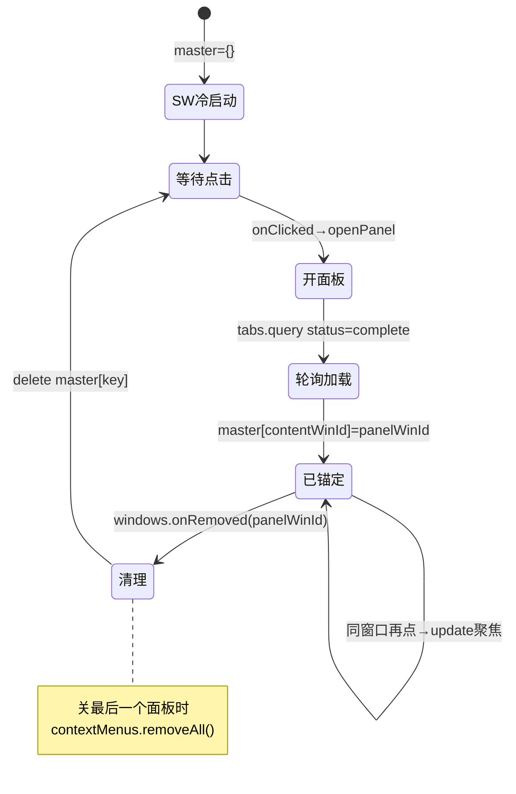
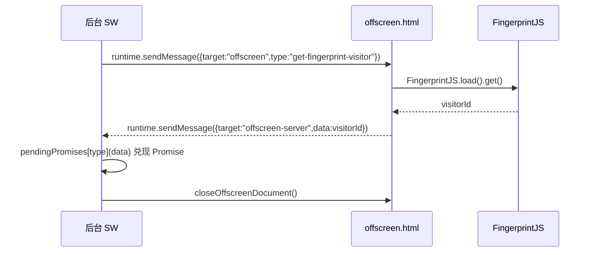

# TECH-05 — MV3 扩展骨架与生命周期

> **一句话概括**：Katalon Recorder 7.1.0 是一个标准的 MV3 扩展，所有后台逻辑被塞进单个 Service Worker（`worker_wrapper.js` 用 `importScripts` 顺序拼接 22 个脚本），通过 `browser.windows.create` 弹出独立 `popup` 窗口替代传统的 `default_popup`，并用 offscreen document / sandbox page / persistent-store / keepAlive 心跳四个关键机制弥补 MV3 对 DOM、localStorage、`eval`、常驻内存的限制。

---

## 1. 关键文件清单

| 文件 | 行数 | 职责 | 裁剪去留 |
|---|---|---|---|
| `manifest.json` | 75 | MV3 清单，定义 SW、content_scripts、sandbox、CSP、权限 | **保留**（必须） |
| `manifest.bak.json` | 222 | 旧版 MV3 清单（bundled 前的分散脚本清单），仅作对照 | **删除**（仅参考） |
| `worker_wrapper.js` | 27 | SW 入口，用 `importScripts` 按序加载 22 个脚本 | **保留**（必须） |
| `background/background.js` | 239 | 核心：openPanel、onClicked、右键菜单、keepAlive | **保留**（必须） |
| `background/install.js` | 98 | 安装/更新钩子、卸载 URL、open-panel/focus-panel 消息 | **保留**（按需删埋点） |
| `background/kar.js` | 330+ | 窗口尺寸记忆、CDP debugger 上传/特殊键 | **保留**（回放上传文件需 CDP） |
| `katalon/background.js` | 376 | 与 Katalon Studio 的 WebSocket 通信 | **删除**（仅官方 IDE 用） |
| `common/persistent-store.js` | 69 | 四级存储回退抽象 | **保留**（跨端配置可删 cookie 回退） |
| `common/promise-utils.js` | 10 | `retryUntilSuccess` 工具 | **保留**（小） |
| `common/offscreen-server.js` | 75 | 后台向 offscreen 发请求/收响应的 Promise 桥 | **保留**（SW 取 DOM 信息需它） |
| `common/offscreen.js` | 29 | offscreen document 内的消息处理 | **保留**（配合 server） |
| `panel/offscreen.html` | — | offscreen 文档入口 | **保留**（若用 fingerprint 则必留） |
| `panel/sandbox.html` | — | sandbox page 入口 | **保留**（storeEval 需 `eval`） |
| `panel/sandbox.js` | 77 | `EvalScope` 在 sandbox 内执行用户 JS | **保留**（storeEval/扩展脚本） |
| `interface/Interface.js` | 36 | 接口契约类（鸭子类型检查） | **删除**（全库未使用） |
| `interface/IPublisher.js` | 5 | 发布者接口 | **删除**（全库未使用） |
| `interface/ISubscriber.js` | 5 | 订阅者接口 | **删除**（全库未使用） |
| `panel/js/background/window-controller.js` | 379 | 回放时管理目标 tab/frame 映射 `ExtCommand` | **保留**（回放核心） |
| `panel/js/background/initial.js` | 50 | `sideex_*` 全局状态初始化 | **保留**（小） |

---

## 2. 核心机制逐层拆解

### 2.1 manifest：MV3 骨架声明

```json
// manifest.json:11-13
"background": {
   "service_worker": "worker_wrapper.js"
},
```

MV3 用 `"service_worker"` 取代 MV2 的 `"scripts"` 数组（常驻后台页）。**关键差异**：SW 在空闲时会被浏览器杀死，状态不常驻，因此所有"全局变量"必须在每次 SW 冷启动时重新初始化（见 2.3）。

```json
// manifest.json:41-43
"content_security_policy": {
   "extension_pages": "script-src 'self'; object-src 'self'; unsafe-eval; unsafe-inline;"
},
```

`extension_pages` 含 `unsafe-eval`，是因为 panel 内的 sandbox 通过 `eval` 执行用户脚本（storeEval / 扩展脚本），而 MV3 的 `sandbox.pages` 允许在 sandbox 上下文里 `unsafe-eval`（见 2.7）。`unsafe-inline` 是因为大量内联事件处理。

```json
// manifest.json:65-67
"sandbox": {
   "pages": [ "panel/sandbox.html" ]
},
```

```json
// manifest.json:64
"permissions": [ "tabs", "activeTab", "contextMenus", "downloads", "webNavigation",
   "notifications", "cookies", "storage", "unlimitedStorage", "debugger", "scripting", "offscreen" ],
```

`offscreen` 与 `debugger` 是 MV3 特有的关键权限：`offscreen` 用于创建无 UI 的后台 DOM 文档，`debugger` 用于 CDP 上传文件/发送特殊键（`background/kar.js`）。`cookies` 被 `persistent-store` 用作跨端持久化的兜底回退（见 2.6）。

### 2.2 worker_wrapper.js：SW 的"bundler"

MV3 的 `service_worker` 只能指定**单个**脚本文件，但 Katalon 有 22 个后台模块。解决方式是用一个壳脚本 `worker_wrapper.js` 通过 `importScripts` 在 SW 全局作用域内顺序同步加载：

```javascript
// worker_wrapper.js:1-26
try {
    importScripts(
        "common/promise-utils.js",
        "background/segment-tracking-services.js",
        "content/bowser.js",
        "common/browser-polyfill.js",
        "common/jwtJsDecode.js",
        "common/browser-fingerprint2.js",
        "common/persistent-store.js",
        "common/get-anonymous-id.js",
        "common/get-browser-fingerprint-background.js",
        "common/get-browser-name-background.js",
        "common/offscreen-server.js",
        "background/background.js",
        "background/install.js",
        "background/kar.js",
        "chrome_variables_init.js",
        "katalon/constants.js",
        "katalon/chrome_variables_default.js",
        "katalon/chrome_common.js",
        "katalon/background.js",
        "panel/js/katalon/papaparse.js"
    );
} catch (e) {
    console.log(e);
}
```

**要点**：
1. `importScripts` 在 SW 中同步执行，加载顺序即全局执行顺序——`master`、`clickEnabled` 等全局变量在 `background/background.js` 定义后，后续模块才能引用（见 2.3 的坑）。
2. 加载用 `try/catch` 包裹且只 `console.log`，**任何一个脚本语法错误都不会中断后续加载**，这导致某些模块静默失效时极难排查（见 5）。
3. 注意 `katalon/background.js`（与 Katalon Studio 通信）也在此加载——裁剪个人插件时可直接删掉这一行及其整个 `katalon/` 树。

> 对照 `manifest.bak.json`：旧版把内容脚本拆成十几个独立 `js` 文件，新版改为 `bundles/content.1.bundle.js` + `content.2.bundle.js`（见 TECH-06）。但**后台脚本始终是单文件 + `importScripts`**，因为 MV3 对 SW 的限制从来如此。

### 2.3 全局变量初始化与 SW 生命周期

`background/background.js` 在顶层（SW 全局）声明了三个贯穿全局的状态变量：

```javascript
// background/background.js:18-20
var master = {};
var clickEnabled = true;
const popupWindowIDs = [];
```

- `master`：`{ [contentWindowId]: panelWindowId }` 映射，**一个浏览器窗口只对应一个 panel 窗口**（防止重复开面板）。
- `clickEnabled`：点击图标的 1 秒节流锁。
- `popupWindowIDs`：已打开的 panel 窗口 id 列表（用于 `focusPanel` 聚焦）。

**生命周期坑（详见第 5 节）**：SW 被杀后这些变量全部清零。`master` 因此会在每次冷启动重新为空——但面板窗口若仍存活，SW 重启后 `master` 丢失会导致"再点图标又开一个面板"。Katalon 用 `browser.windows.onRemoved` 在面板关闭时清理 `master`，并用 `onConnect` 重建 `port`（见 2.4）；但 SW 重启后若面板仍在而 `master` 为空，行为存在边界问题（见 5.2）。

### 2.4 各上下文的消息通道全景

MV3 下消息通道有四类，必须分清：

| 通道 | API | 方向 | 用途 | 代码位置 |
|---|---|---|---|---|
| 一次性消息 | `tabs.sendMessage` / `runtime.sendMessage` | 双向（Promise/callback） | openPanel 桥接 selfWindowId | `background.js:94` |
| 长连接 port（图标→内容） | `runtime.connect` + `port.postMessage` | 后台→内容 | 右键菜单命令下发 | `recorder-handlers.js:473` |
| 长连接 port（内容→后台） | `runtime.onConnect` | 内容→后台 | 后台持有 `port` 引用 | `background.js:233-235` |
| offscreen 请求桥 | `runtime.sendMessage({target:"offscreen"})` | 后台→offscreen | 取浏览器名/指纹 | `offscreen-server.js:30` |

**重点：右键菜单的长连接链路**（这条链路有三个易错点）：
1. 后台注册 `contextMenus.onClicked`，在回调里向已存在的 `port` 推送命令：
   ```javascript
   // background/background.js:228-235
   var port;
   browser.contextMenus.onClicked.addListener(function (info, tab) {
     port.postMessage({ cmd: info.menuItemId });
   });
   browser.runtime.onConnect.addListener(function (m) {
     port = m;
   });
   ```
2. 内容脚本在用户右键时**临时** `connect` 后台，建立 `myPort` 并注册 `onMessage` 监听：
   ```javascript
   // content/recorder-handlers.js:472-491
   Recorder.addEventHandler('contextMenu', 'contextmenu', async function (event) {
       var myPort = await browser.runtime.connect();
       ...
       myPort.onMessage.addListener(function portListener(m) {
           if (m.cmd.includes("Text")) { self.record(m.cmd, tmpText, tmpVal); }
           ...
           myPort.onMessage.removeListener(portListener);
       });
   }, true);
   ```
3. 时序要求：**必须先 `connect` 让后台的 `port = m` 生效，后台右键回调才能 `port.postMessage` 送达**。因为 `connect` 与 `onClicked` 是用户操作的两次独立事件，Katalon 的契约是"右键时内容脚本先 connect，菜单点击时后台再 postMessage"——若后台 SW 刚冷启动、`port` 尚未被任何 connect 赋值，`port.postMessage` 会抛 `undefined` 错误（见 5.3）。

### 2.5 openPanel：弹出独立窗口（详情见 TECH-07）

`openPanel` 是入口核心，但属于"入口与弹框"主题，完整拆解在 TECH-07。此处只点出它在生命周期中的位置：

```javascript
// background/background.js:108
browser.action.onClicked.addListener(openPanel);
```

即：点击工具栏图标 → `openPanel(tab)` → `browser.windows.create({type:"popup", url:"panel/index.html"})`。**注意 manifest 顶层 `"default_popup"`（manifest.json:44）在 MV3 被忽略**（TECH-07 专门论证）。

### 2.6 persistent-store：SW 失忆的存储补偿

MV3 SW 无 `localStorage`、且 `storage.local` 是异步的。Katalon 抽象出 `persistent-store`，四级回退：

```javascript
// common/persistent-store.js:13-40
async function getPersistentValue(key, defaultValueProvider = () => "") {
  if (persistentCache[key]) return persistentCache[key];          // 0. 内存缓存
  const localValue = await browser.storage.local.get(key)...;     // 1. storage.local
  if (localValue?.[key]) return localValue[key];
  const syncValue = await browser.storage.sync.get(key)...;       // 2. storage.sync
  if (syncValue?.[key]) return syncValue[key];
  const cookieName = getPersistentCookieName(key);                // 3. cookie
  const cookies = await browser.cookies.getAll({ name: cookieName });
  const cookieValue = cookies.find((cookie) => cookie.value)?.value;
  if (cookieValue) return JSON.parse(decodeURIComponent(cookieValue));
  const defaultValue = await defaultValueProvider();             // 4. 默认值并落库
  await setPersistentValue(key, defaultValue);
  return defaultValue;
}
```

```javascript
// common/persistent-store.js:42-56
async function setPersistentValue(key, value) {
  persistentCache[key] = value;
  await Promise.allSettled([
    browser.storage.local.set({ [key]: value }),
    browser.storage.sync.set({ [key]: value }),
    browser.cookies.set({                                       // 写入 .katalon-persistent-domain.com
      url: PERSISTENT_STORE_URL,
      domain: PERSISTENT_STORE_DOMAIN,
      name: getPersistentCookieName(key),
      value: encodeURIComponent(JSON.stringify(value)),
      expirationDate: new Date("9999-12-31").getTime() / 1000,
    }),
  ]);
  return value;
}
```

要点：
- 写操作同时落 `storage.local` + `storage.sync` + **cookie**（`domain: ".katalon-persistent-domain.com"`，`PERSISTENT_STORE_URL = "http://katalon-persistent-domain.com/"`）。cookie 回退是为了跨配置文件/跨设备同步（官方账号体系）。
- 个人插件若不需要跨端，可删掉 cookie 回退（需 `cookies` 权限与 `host_permissions` 中对应域）。

### 2.7 sandbox page：MV3 下 `eval` 的逃生舱

MV3 禁止在扩展页面（panel/background）里直接 `eval`（CSP 不允许），但录制回放需要执行用户 `storeEval` 和扩展脚本。方案是 `sandbox.pages`：

```html
<!-- panel/sandbox.html -->
<script type="module" src="./sandbox.js"></script>
```

```javascript
// panel/sandbox.js:28-54
export class EvalScope {
  input = newPromise();
  output = newPromise();
  constructor() { this.run(); }
  async run() {
    do {
      const expression = await this.input.promise;
      this.input = newPromise();
      try {
        const result = await (0, eval)(expression);   // 在 sandbox 内合法
        this.output.resolve(result);
      } catch (error) { this.output.reject(error); }
      this.output = newPromise();
    } while (true);
  }
  async eval(script) { this.input.resolve(script); return this.output.promise; }
}
```

panel 侧通过隐藏 iframe 加载 `sandbox.html`，用 `postMessage` 把脚本送进去执行：

```javascript
// panel/js/UI/services/helper-service/SandboxEvaluator.js:15-44
export class SandboxEvaluator {
  constructor(sandboxPath = "sandbox.html") { ... }
  init() {
    this.sandbox = document.createElement("iframe");
    this.sandbox.src = this.sandboxPath;
    this.sandbox.style.display = "none";
    document.body.appendChild(this.sandbox);
    window.addEventListener("message", (event) => {
      if (event.data?.type === "eval-result") { this.outputPromise.resolve(event.data.result); ... }
      if (event.data?.type === "eval-error")  { this.outputPromise.reject(event.data.error); ... }
    });
  }
  async eval(script) { this.sandbox.contentWindow.postMessage(script, "*"); return this.outputPromise.promise; }
}
```

注意 `sandbox.js` 用的是 `(0, eval)(expression)`（间接 eval），在 sandbox 文档里 `eval` 的作用域是 sandbox 全局而非调用方。这是执行"用户自定义 JS"最安全的位置——即使脚本恶意，也只能影响 sandbox iframe，不接触 panel 主世界。

### 2.8 offscreen document：SW 取 DOM 能力的补偿

SW 没有 DOM、`window`、`document`，但 `getBrowserName()` 用到了 `window`/`navigator`/`document`（`common/get-browser-name.js:4-64`）。于是后台版本把它转发给 offscreen：

```javascript
// common/get-browser-name-background.js:1-4
function getBrowserName() {
  return sendMessageToOffscreenDocument("get-browser-name");
}
```

```javascript
// common/offscreen-server.js:21-52
async function sendMessageToOffscreenDocument(type) {
  await createOffscreenDocument();
  const messagePromise = new Promise((resolve) => { pendingPromises[type] = resolve; });
  chrome.runtime.sendMessage({ type, target: "offscreen" });
  const data = await messagePromise;
  await closeOffscreenDocument();
  return data;
}
async function createOffscreenDocument() {
  if (!(await hasOffscreenDocument())) {
    await chrome.offscreen.createDocument({
      url: "panel/offscreen.html",
      reasons: [chrome.offscreen.Reason.DOM_SCRAPING],
      justification: "Scrape the DOM to get information.",
    });
  }
}
```

offscreen 文档内处理消息并回传：

```javascript
// common/offscreen.js:3-29
async function handleReceivedMessage(message) {
  if (message.target !== "offscreen") return false;
  switch (message.type) {
    case "get-browser-name":
      returnMessage(message.type, getBrowserName()); break;
    case "get-fingerprint-visitor":
      const visitor = await (await FingerprintJS.load({ region: "ap" })).get();
      returnMessage(message.type, visitor); break;
  }
}
```

注意 `offscreen-server.js` 用 `chrome.*`（不是 `browser.*`），因为它依赖 `chrome.offscreen.createDocument` / `chrome.runtime.getContexts`，这些是 Chrome 专有 API，Firefox MV3 不支持 offscreen（见 TECH-06）。`hasOffscreenDocument` 用 `chrome.runtime.getContexts` 判断，Firefox 走 `clients.matchAll` 兜底（offscreen-server.js:62-75）。

### 2.9 keepAlive：对抗 SW 被杀

MV3 SW 在闲置约 30 秒（Chrome）后被杀。Katalon 用定时 ping 维持：

```javascript
// background/background.js:237-239
const keepAlive = () => setInterval(browser.runtime.getPlatformInfo, 20e3);
browser.runtime.onStartup.addListener(keepAlive);
keepAlive();
```

每 20 秒调用一次 `browser.runtime.getPlatformInfo` 产生扩展活动，使 SW 不被回收。**代价**：SW 几乎常驻，电量/内存开销上升。个人插件若只需"点击才工作"，可去掉 keepAlive，让 SW 自然休眠（但 openPanel 的 `master` 状态会丢，见 5.2）。

### 2.10 window-controller：回放时把面板"锚定"到目标窗口

回放模块 `ExtCommand` 在创建/更新目标 tab 后，把映射写回后台的 `master`：

```javascript
// panel/js/background/window-controller.js:328-331
browser.runtime.getBackgroundPage()
  .then(function(backgroundWindow) {
      backgroundWindow.master[window.id] = recorder.getSelfWindowId();
  });
```

这里 `getBackgroundPage()` 在 MV3 中返回的是 SW 的全局对象（Chrome 支持，Firefox 不支持——见 TECH-06）。它让"回放窗口"和"录制窗口"通过 `master` 互知。回放命令发送用 `retryUntilSuccess` 重试（见 2.11）。

### 2.11 promise-utils：异步重试

```javascript
// common/promise-utils.js:1-11
async function retryUntilSuccess(func, maxRetry = 30, interval = 100) {
    while (maxRetry > 0) {
        try { return await func(); }
        catch (e) { maxRetry--; await new Promise((resolve) => setTimeout(resolve, interval)); }
    }
    throw new Error('Retry failed');
}
```

回放时目标 tab 可能还没加载完，`sendCommand` 用它在 100ms 间隔、最多 30 次（3 秒）内重试直到成功。

### 2.12 interface/*：一套未被使用的发布订阅接口

```javascript
// interface/Interface.js:17-34
Interface.ensureImplement = function (object, interfaces) {
  if (arguments.length < 2) throw new Error(...);
  interfaces.forEach(inter => {
    if (inter.constructor !== Interface) throw new Error(...);
    inter.methods.forEach(method => {
      if (!object[method] || typeof object[method] !== 'function') {
        throw new Error(`...Method ${method} was not found.`);
      }
    });
  });
}
```

```javascript
// interface/IPublisher.js:1-4
const IPublisher = new Interface("IPublisher", ["addSubscriber", "removeSubscriber", "notify"]);
// interface/ISubscriber.js:1-4
const ISubscriber = new Interface("ISubscriber", ["update"]);
```

全库 `grep` 仅在 `interface/` 三个文件内出现，**没有任何消费方**调用 `Interface.ensureImplement` 或引用 `IPublisher`/`ISubscriber`。这应是早期架构设想（发布订阅解耦录制/回放/UI），实际并未落地。裁剪时直接删除整个 `interface/` 目录不影响任何功能。

### 2.13 install.js：安装/更新生命周期钩子

```javascript
// background/install.js:17-33
browser.runtime.onInstalled.addListener(function (details) {
  runAutoUpdate();
  if (details.reason === "install") {
    browser.tabs.create({ url: browser.runtime.getURL("/pages/welcome/welcome.html") });
    trackingInstallApp();                                  // ← 埋点
    browser.storage.local.set({ firstTime: true });
  } else if (details.reason === "update") {
    browser.storage.local.set({ tracking: { isUpdated: true } });
  }
});
```

```javascript
// background/install.js:64-80
browser.runtime.onMessage.addListener(function (message, sender, sendResponse) {
  if (message === "open-panel")  { openPanel(sender.tab, true); sendResponse("OK"); return false; }
  if (message === "focus-panel") { focusPanel(); sendResponse("OK"); return false; }
  if (message?.target !== "offscreen-server" && message?.target !== "offscreen") {
    configUninstallUrl();                                  // ← 每次消息都刷新卸载 URL（埋点）
  }
  return false;
});
```

要点：`open-panel` / `focus-panel` 这两个字符串消息被 welcome 页与营销弹窗用来唤起/聚焦面板（TECH-07）。`configUninstallUrl` 拼装带 `segment.userId` 的卸载调研链接——个人插件应删。

---

## 3. 关键数据结构与状态机

### 3.1 `master` 映射状态机



### 3.2 右键菜单长连接时序

```mermaid
sequenceDiagram
    participant U as 用户
    participant C as 内容脚本(recorder-handlers)
    participant B as 后台 SW
    participant M as 浏览器右键菜单

    U->>C: 右键(触发 contextmenu)
    C->>B: browser.runtime.connect() → 后台 port=m
    C->>C: myPort.onMessage.addListener(录命令)
    U->>M: 选择 verifyText
    M->>B: contextMenus.onClicked(info)
    B->>C: port.postMessage({cmd:"verifyText"})
    C->>C: record("verifyText", ...); removeListener
```

### 3.3 offscreen 请求桥时序



---

## 4. 隐晦知识点与坑

1. **`default_popup` 写在 `action` 外面被忽略**：`manifest.json:44` 的 `"default_popup": "popup-browser/index.html"` 在顶层（不在 `action` 内），MV3 规范里 `action.default_popup` 才会渲染点击弹层。顶层 `default_popup` 是 MV2 残留字段，MV3 完全忽略。且 `popup-browser/` 目录在发行包中**根本不存在**（TECH-07 实证）。所以点击图标**不会**弹小弹窗，而是走 `onClicked` → 独立窗口。

2. **SW 全局变量在休眠后清零**：`master`、`clickEnabled` 都是 SW 全局变量。SW 被杀再唤醒时它们重置为空/true。若面板窗口还开着但 SW 重启，`master` 为空 → 再点图标会再开一个面板（除非 `onConnect` 已重新建立）。这是 MV3 移植 MV2 后台代码最经典的坑。

3. **`port` 未初始化即 `postMessage` 会崩**：`contextMenus.onClicked` 回调里直接 `port.postMessage`，但 `port` 只在 `onConnect` 时被赋值。后台 SW 冷启动后若用户还没触发过内容脚本的 `connect`，`port` 为 `undefined`，点击菜单会抛 `Cannot read properties of undefined`。Katalon 的依赖链是"内容脚本先 connect，后台才有 port"——脆弱但有契约保证。

4. **`importScripts` 失败被静默吞掉**：`worker_wrapper.js:24-26` 的 `catch` 只 `console.log`，单个后台脚本语法错误不会中断其他脚本加载，导致"功能悄悄没了"难以定位。

5. **keepAlive 让 SW 几乎常驻**：每 20 秒 ping 一次，牺牲了 MV3 的电量优势。若去掉 keepAlive，所有依赖 SW 常驻的状态（master、port）会在无活动时丢失。

6. **offscreen 用 `chrome.*` 而非 `browser.*`**：`offscreen-server.js` 直接调 `chrome.offscreen.createDocument`、`chrome.runtime.getContexts`，因为 `browser.offscreen` polyfill 不完整（Firefox 无此 API）。这是 MV3 跨浏览器兼容的硬骨头，详见 TECH-06。

7. **`getBackgroundPage()` 仅 Chrome 支持**：`window-controller.js:328` 在 Firefox MV3 中 `getBackgroundPage()` 仍可用（Firefox 会返回 SW 全局），但语义与 MV2 不同，跨浏览器需谨慎。

8. **sandbox 的 `(0, eval)` 间接 eval**：`sandbox.js:41` 用间接 eval 使代码在 sandbox 全局执行，且 sandbox 文档无 `chrome.runtime` 直接访问面板的能力（仍通过 postMessage 通信），天然隔离。

---

## 5. 裁剪建议（保留 / 删除 / 替换）

| 分类 | 文件/机制 | 理由 |
|---|---|---|
| **保留** | `manifest.json`、`worker_wrapper.js`、`background/background.js`、`background/install.js`（去埋点）、`background/kar.js`（去指纹）、`common/persistent-store.js`、`common/promise-utils.js`、`common/offscreen-server.js`+`offscreen.js`、`panel/sandbox.html`+`sandbox.js`+`SandboxEvaluator.js`、`window-controller.js`、`initial.js` | 个人录制回放插件的 MV3 骨架必需 |
| **删除** | `interface/Interface.js`、`IPublisher.js`、`ISubscriber.js` | 全库未使用，纯死代码 |
| **删除** | `katalon/background.js` 及 `worker_wrapper.js` 中 `katalon/*` 相关 `importScripts` 行 | 仅用于连接官方 Katalon Studio（WebSocket），个人插件用不到 |
| **删除** | `background/segment-tracking-services.js`、`common/browser-fingerprint2.js`、`common/get-browser-fingerprint*.js`、`configUninstallUrl` 埋点 | 用户行为追踪/指纹，个人插件应去除（同时删 `offscreen` 中 `get-fingerprint-visitor` 分支） |
| **替换** | `worker_wrapper.js` 的 22 文件 `importScripts` | 若用真实打包工具（Vite/webpack），可改为单 bundle，删除 importScripts 壳 |
| **替换** | `keepAlive` 心跳 | 个人插件若不依赖 SW 常驻，可改为 Event-driven（仅 `onClicked`/`onMessage` 唤醒），省电 |
| **替换** | `persistent-store` 的 cookie 回退 | 不需要跨端同步则删 cookie 写入，保留 storage.local/sync |
| **删除** | `manifest.bak.json` | 仅开发对照用，不随包发布 |

---

## 6. 最小可用实现（MVP 代码骨架）

以下骨架实现一个"点击图标弹独立窗口 + 右键菜单录命令 + storeEval 沙箱"的最小 MV3 扩展。

### 6.1 `manifest.json`

```json
{
  "manifest_version": 3,
  "name": "Mini Recorder",
  "version": "0.1.0",
  "action": { "default_title": "Mini Recorder" },
  "background": { "service_worker": "worker_wrapper.js" },
  "permissions": ["contextMenus", "storage", "offscreen", "scripting"],
  "host_permissions": ["<all_urls>"],
  "sandbox": { "pages": ["sandbox.html"] },
  "content_scripts": [{
    "matches": ["<all_urls>"], "all_frames": true, "run_at": "document_start",
    "js": ["content.js"]
  }],
  "content_security_policy": {
    "extension_pages": "script-src 'self'; object-src 'self'; unsafe-eval; unsafe-inline;"
  }
}
```

### 6.2 `worker_wrapper.js`

```javascript
importScripts(
  "persistent-store.js",
  "offscreen-server.js",
  "background.js"
);
```

### 6.3 `background.js`

```javascript
var master = {};
var clickEnabled = true;

function openPanel(tab) {
  if (master[tab.windowId] != undefined) {
    browser.windows.update(master[tab.windowId], { focused: true });
    return;
  }
  if (!clickEnabled) return;
  clickEnabled = false;
  setTimeout(() => (clickEnabled = true), 1000);

  browser.windows.create({
    url: browser.runtime.getURL("panel.html"),
    type: "popup", height: 630, width: 1080, focused: true,
  }).then((w) => {
    master[tab.windowId] = w.id;
    if (Object.keys(master).length === 1) createMenus();
  });
}

browser.action.onClicked.addListener(openPanel);

browser.windows.onRemoved.addListener((id) => {
  for (const k in master) if (master[k] === id) { delete master[k]; break; }
  if (Object.keys(master).length === 0) browser.contextMenus.removeAll();
});

function createMenus() {
  ["verifyText","assertText","storeText"].forEach((id) =>
    browser.contextMenus.create({ id, title: id, contexts: ["all"] }));
}

var port;
browser.contextMenus.onClicked.addListener((info) => {
  if (port) port.postMessage({ cmd: info.menuItemId });
});
browser.runtime.onConnect.addListener((m) => (port = m));

// 可选：keepAlive
const keepAlive = () => setInterval(browser.runtime.getPlatformInfo, 20000);
keepAlive();
```

### 6.4 `sandbox.html` + `sandbox.js`（storeEval 逃生舱）

```html
<!-- sandbox.html -->
<script src="./sandbox.js"></script>
```

```javascript
// sandbox.js
addEventListener("message", async (e) => {
  try { postMessage({ type: "eval-result", result: await (0, eval)(e.data) }, "*"); }
  catch (err) { postMessage({ type: "eval-error", error: String(err) }, "*"); }
});
```

### 6.5 `content.js`（右键 connect 后台）

```javascript
browser.runtime.onMessage.addListener((msg, sender, send) => {
  if (msg.cmd) { console.log("录命令:", msg.cmd); /* self.record(...) */ }
});
document.addEventListener("contextmenu", async () => {
  const p = await browser.runtime.connect();
  p.onMessage.addListener((m) => { /* 收到后台下发的 cmd 就录制 */ });
});
```

---

> 本文件所有结论均可溯源至 `KatalonRecorder/7.1.0_0/` 源码对应 `文件:行号`；未找到确切依据的均标注「推测」。
