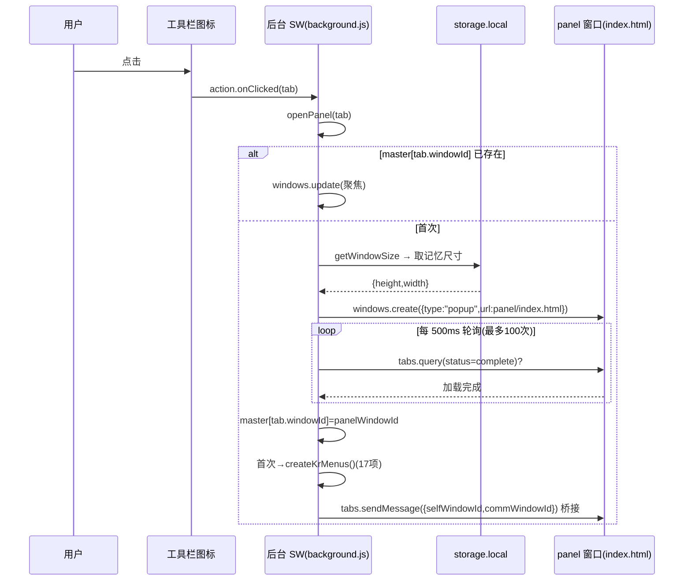
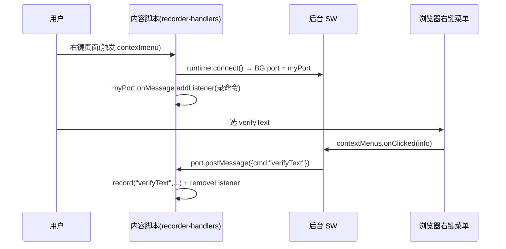
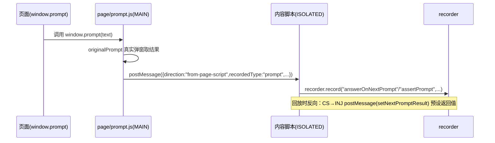
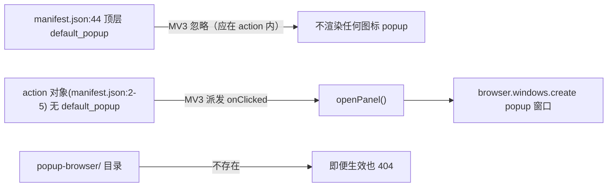

# TECH-07 — 入口与弹框体系

> **一句话概括**：Katalon Recorder 7.1.0 **没有真正的 popup 弹层**——`manifest.json:44` 的 `"default_popup": "popup-browser/index.html"` 写在 `action` 对象**外面**（MV3 规范里这个字段必须放在 `action` 内才生效），因此被 MV3 完全忽略；而且 `popup-browser/` 目录在发行包里**根本不存在**。点击图标实际走 `browser.action.onClicked` → `openPanel()` → `browser.windows.create` 弹出一个**独立 popup 窗口**；此外还有右键菜单命令、页面内录制浮层、prompt/confirm/alert 接管、欢迎页、营销弹窗等多套"入口/弹框"机制。

---

## 1. 关键文件清单

| 文件 | 行数 | 职责 | 裁剪去留 |
|---|---|---|---|
| `manifest.json` | 75 | 顶层 `default_popup`（无效）+ `action`（无 popup） | **保留**（删无效字段） |
| `background/background.js` | 239 | `openPanel`、onClicked、右键菜单、focusPanel | **保留**（核心入口） |
| `background/install.js` | 98 | 安装开 welcome 页、open-panel/focus-panel 消息 | **保留**（去埋点） |
| `background/kar.js` | 330+ | `getWindowSize` 记忆面板尺寸 | **保留** |
| `pages/welcome/welcome.html` + `welcome.js` | 43 / 13 | 首装欢迎页 → 唤起面板 → 跳登录 | **删除/改**（官方登录） |
| `katalon/authenticated.html` | 30 | 登录回调页（web_accessible_resource） | **删除**（官方账号） |
| `content/inject-popup-record.js` | 102 | 页面内 `#popupInjectionKR` 录制提示浮层 | **保留**（录制态提示） |
| `content/toastify.js` | 1.11.2 | 轻提示 toast 库（panel 引用） | **保留**（小） |
| `content/prompt-injecter.js` | 75 | 注入 `page/prompt.js` 接管对话框 | **保留**（录对话框） |
| `page/prompt.js` | 283 | 重写 `window.prompt/confirm/alert` | **保留**（录对话框） |
| `content/recorder-handlers.js` | 472-491 | 右键 connect 后台 + 录命令 | **保留**（右键录） |
| `katalon/ku-recorder-event-handlers.js` | 503-522 | Katalon 版同上（connect 后台） | **删除**（官方） |
| `panel/index.html` | — | 主面板入口（独立窗口加载） | **保留** |
| `content-marketing/panel/*.js` | 11 文件 / ~2000 行 | 营销弹窗（评分/注册/分享等） | **删除**（全删） |
| `panel/sandbox.html` + `sandbox.js` | — / 77 | storeEval 沙箱（见 TECH-05/06） | **保留** |

---

## 2. 核心机制逐层拆解

### 2.1 ⚠️ 反直觉事实：`default_popup` 写在 `action` 外面，被 MV3 忽略

先看 `manifest.json` 的真实结构（注意缩进层级）：

```json
// manifest.json:2-5
"action": {
   "default_icon": "katalon/images/branding/branding_16.png",
   "default_title": "Katalon Recorder"
},
// ... 中间隔了很多字段 ...
// manifest.json:44
"default_popup": "popup-browser/index.html",
```

**关键观察**：
1. `"default_popup"` 出现在 `manifest.json:44`，它和 `"action"`（2-5 行）是**并列的顶层字段**，并不在 `action` 对象内部。
2. MV3 规范规定：点击图标弹出的小弹层由 **`action.default_popup`** 控制（字段在 `action` 内）。顶层 `default_popup` 是 **MV2 的遗留写法**，MV3 解析器会**直接忽略**它。
3. 即便它生效，指向的 `popup-browser/index.html` 也打不开——因为 **`popup-browser/` 目录在发行包中根本不存在**（已 `ls -d popup-browser` 实证：`No such file or directory`）。

**结论**：点击工具栏图标**不会**出现任何 popup 小窗，而是触发 `browser.action.onClicked` 事件（因为 `action` 没有 `default_popup`，MV3 才会派发 `onClicked`）。这正好与下面的 `openPanel` 链路衔接。

> 佐证：`manifest.bak.json:207` 同样把 `"default_popup": "popup-browser/index.html"` 写在顶层、且 `bak` 里的 `action`（203-206 行）也没有 `default_popup`。说明从 MV2 到 MV3 这一行从未纠正——Katalon 始终靠 `onClicked`→独立窗口，从未真正用过 `default_popup`。

### 2.2 `openPanel`：点击图标弹独立窗口（核心入口）

```javascript
// background/background.js:108
browser.action.onClicked.addListener(openPanel);
```

```javascript
// background/background.js:29-106
function openPanel(tab, noFocus = false) {
  let contentWindowId = tab.windowId;
  if (master[contentWindowId] != undefined) {            // 已开过 → 聚焦，不重复开
    browser.windows.update(master[contentWindowId], { focused: !noFocus })
      .catch(function (e) {
        master[contentWindowId] == undefined;            // ⚠️ bug：== 比较，未真正删除
        openPanel(tab);
      });
    return;
  } else if (!clickEnabled) {                             // 1 秒节流中 → 直接返回
    return;
  }

  clickEnabled = false;
  setTimeout(function () { clickEnabled = true; }, 1000); // 节流锁

  var f = function (height, width) {
    const url = "panel/index.html";
    browser.windows.create({                             // ← 弹独立 popup 窗口
      url: browser.runtime.getURL(url),
      type: "popup",
      height: height,
      width: width,
      focused: !noFocus,
    })
    .then(function waitForPanelLoaded(panelWindowInfo) {
      return new Promise(function (resolve, reject) {
        let count = 0;
        let interval = setInterval(function () {         // 轮询等面板加载（最多 50 秒）
          if (count > 100) { reject("SideeX editor has no response"); clearInterval(interval); }
          browser.tabs.query({
            active: true, windowId: panelWindowInfo.id, status: "complete",
          }).then(function (tabs) {
            if (tabs.length != 1) { count++; return; }
            else {
              master[contentWindowId] = panelWindowId;   // 锚定映射
              if (Object.keys(master).length === 1) { createKrMenus(); }  // 首开注册右键菜单
              resolve(panelWindowInfo);
              clearInterval(interval);
            }
          });
        }, 500);
      });
    })
    .then(function bridge(panelWindowInfo) {             // 桥接：告诉面板它是谁、通信窗口是谁
      popupWindowIDs.push(panelWindowInfo.id);
      return browser.tabs.sendMessage(panelWindowInfo.tabs[0].id, {
        selfWindowId: panelWindowInfo.id,                // 面板自己的窗口 id
        commWindowId: contentWindowId,                   // 触发点击的浏览器窗口 id
      });
    })
    .catch(function (e) { console.log(e); });
  };

  getWindowSize(f, false);                               // 取上次记忆的尺寸
}
```

**逐点拆解**：
1. **`master[contentWindowId]` 一对一防重复**：每个浏览器窗口（`tab.windowId`）最多对应一个面板窗口。再点同窗口的图标只 `windows.update` 聚焦，不会开第二个。
2. **`clickEnabled` 1 秒节流**：连点图标在 1 秒内只响应一次。
3. **`type: "popup"`**：`browser.windows.create` 的 `popup` 类型是无地址栏/无标签栏的独立小窗（区别于普通 `normal` 窗口）。这就是用户看到的"插件面板"。
4. **轮询等加载**：用 `setInterval` 每 500ms 查一次面板 tab 是否 `status:"complete"`，最多 100 次（50 秒）。超时 reject "SideeX editor has no response"——若面板 JS 报错卡白屏，这里会静默失败。
5. **桥接消息**：面板加载完后，`tabs.sendMessage` 把 `selfWindowId`（面板窗 id）和 `commWindowId`（来源浏览器窗 id）发给面板，面板据此建立双向通信映射（见 `window-controller.js`）。
6. **`getWindowSize` 记忆尺寸**：见 2.3。

**隐藏 bug（见第 5 节）**：`:37` `master[contentWindowId] == undefined;` 用的是 `==`（比较）而不是 `=`/delete，本意是"面板窗已关，清掉映射"，实际什么都没做，只触发了一次 `openPanel(tab)` 重试。

### 2.3 `getWindowSize`：面板尺寸记忆

```javascript
// background/kar.js:2-20
function getWindowSize(callback) {
    browser.storage.local.get('window').then(function(result) {
        var height = 630, width = 1080;                  // 默认尺寸
        if (result) {
            try {
                result = result.window;
                if (result.height) height = result.height;
                if (result.width)  width  = result.width;
            } catch (e) {}
        }
        callback(height, width);
    });
}
```

面板关闭/拖动改变大小后，把新尺寸写回 `storage.local.window`，下次 `openPanel` 用记忆尺寸开窗。默认 1080×630。

### 2.4 右键菜单：17 个录制命令

面板**首次成功打开**时（`master` 长度变 1），注册 17 个右键菜单项：

```javascript
// background/background.js:82-84（在 openPanel 加载完成后触发）
if (Object.keys(master).length === 1) {
  createKrMenus();
}
```

```javascript
// background/background.js:123-226（createKrMenus，节选）
browser.contextMenus.create({ id: "verifyText",    title: "verifyText",    documentUrlPatterns:["<all_urls>"], contexts:["all"] });
browser.contextMenus.create({ id: "verifyTitle",   title: "verifyTitle",   ... });
browser.contextMenus.create({ id: "verifyValue",   title: "verifyValue",   ... });
browser.contextMenus.create({ id: "assertText",    title: "assertText",    ... });
browser.contextMenus.create({ id: "assertTitle",   title: "assertTitle",   ... });
browser.contextMenus.create({ id: "assertValue",   title: "assertValue",   ... });
browser.contextMenus.create({ id: "storeText",     title: "storeText",     ... });
browser.contextMenus.create({ id: "storeTitle",    title: "storeTitle",    ... });
browser.contextMenus.create({ id: "storeValue",    title: "storeValue",    ... });
browser.contextMenus.create({ id: "waitForElementPresent",     title: "waitForElementPresent",     ... });
browser.contextMenus.create({ id: "waitForElementNotPresent",  title: "waitForElementNotPresent",  ... });
browser.contextMenus.create({ id: "waitForTextPresent",        title: "waitForTextPresent",        ... });
browser.contextMenus.create({ id: "waitForTextNotPresent",     title: "waitForTextNotPresent",     ... });
browser.contextMenus.create({ id: "waitForValue",              title: "waitForValue",              ... });
browser.contextMenus.create({ id: "waitForNotValue",           title: "waitForNotValue",           ... });
browser.contextMenus.create({ id: "waitForVisible",            title: "waitForVisible",            ... });
browser.contextMenus.create({ id: "waitForNotVisible",         title: "waitForNotVisible",         ... });
```

**命令下发链路**（详见 TECH-05 §2.4）：
```javascript
// background/background.js:228-235
var port;
browser.contextMenus.onClicked.addListener(function (info, tab) {
  port.postMessage({ cmd: info.menuItemId });     // 后台 → 内容脚本
});
browser.runtime.onConnect.addListener(function (m) { port = m; });
```
内容脚本在 `contextmenu` 事件时 `connect` 后台（先建好 `port`），再监听 `onMessage` 收到 `cmd` 后录制：

```javascript
// content/recorder-handlers.js:472-491
Recorder.addEventHandler('contextMenu', 'contextmenu', async function (event) {
    var myPort = await browser.runtime.connect();
    const eventTarget = getEventTarget(event);
    var tmpText  = this.locatorBuilders.buildAll(eventTarget);
    var tmpVal   = getText(eventTarget);
    var tmpTitle = normalizeSpaces(eventTarget.ownerDocument.title);
    var self = this;
    myPort.onMessage.addListener(function portListener(m) {
        if (m.cmd.includes("Text"))  self.record(m.cmd, tmpText, tmpVal);
        else if (m.cmd.includes("Title")) self.record(m.cmd, [[tmpTitle]], '');
        else if (m.cmd.includes("Value")) self.record(m.cmd, tmpText, getInputValue(eventTarget));
        else if (m.cmd.includes('waitFor')) self.record(m.cmd, tmpText, '');
        myPort.onMessage.removeListener(portListener);
    });
}, true);
```

**关闭最后一个面板时清菜单**：
```javascript
// background/background.js:110-120
browser.windows.onRemoved.addListener(function (windowId) {
  let keys = Object.keys(master);
  for (let key of keys) {
    if (master[key] === windowId) {
      delete master[key];
      if (keys.length === 1) { browser.contextMenus.removeAll(); }  // 删最后一个
    }
  }
});
```

### 2.5 页面内录制浮层 `#popupInjectionKR`

录制开始时，后台发消息让内容脚本在页面注入一个"正在录制"提示条：

```javascript
// content/inject-popup-record.js:1-11
function injectRecord(request, sender, sendResponse, type) {
    if (request.attachRecorder) {
        if ($('#popupInjectionKR').length == 0) addPopup();
        return;
    } else if (request.detachRecorder) {
        removePopup();
        return;
    }
}
browser.runtime.onMessage.addListener(injectRecord);
```

浮层是一个可拖动的固定定位 div，含 "Katalon Recorder is recording ..." 文案和 "Stop" 按钮（点 Stop 发 `{ checkStopInContentScript: true }`）：

```javascript
// content/inject-popup-record.js:19-82（节选）
function addPopup() {
    const div = document.createElement('div');
    div.id = "popupInjectionKR";
    div.style = `display:flex!important; ... position:fixed!important; top:90%!important; left:35%!important; ... z-index:99999999!important;`;
    const button = document.createElement('button');
    button.innerHTML = trustedPolicy.createHTML("Stop");   // ← 用 Trusted Types（见 TECH-06 §2.5）
    button.addEventListener("click", function () {
        browser.runtime.sendMessage({ checkStopInContentScript: true });
    });
    document.body.appendChild(div);
    // 拖动逻辑 ...
}
```

注意：此浮层在 **MAIN world 内容脚本**里创建（用了 `trustedPolicy`，见 TECH-06），因为它要显示在真实页面上并能被用户拖动。

### 2.6 `prompt`/`confirm`/`alert` 接管（对话框录制）

录制网页里的 `prompt/confirm/alert` 必须拦截，否则浏览器原生对话框会阻塞。链路：

1. 内容脚本注入 `page/prompt.js`：
```javascript
// content/prompt-injecter.js:20-24
(async () => {
    var s = document.createElement("script");
    s.src = trustedPolicy.createScriptURL(await browser.runtime.getURL("page/prompt.js"));
    (document.head || document.documentElement).appendChild(s);
})();
```

2. `page/prompt.js` 重写 `window.prompt/confirm/alert`（在 MAIN world 页面里），把调用通过 `postMessage({direction:"from-page-script"})` 发给内容脚本：
```javascript
// page/prompt.js:118-135（top window 的 prompt 重写）
window.prompt = function(text, defaultText) {
  if (document.body.hasAttribute("setPrompt")) {
    recordedPrompt = text; document.body.removeAttribute("setPrompt");
    return nextPromptResult;
  } else {
    let result = originalPrompt(text, defaultText);
    let frameLocation = getFrameLocation();
    window.top.postMessage({ direction:"from-page-script", recordedType:"prompt",
      recordedMessage:text, recordedResult:result, frameLocation }, "*");
    return result;
  }
};
```

3. 内容脚本（ISOLATED world）监听 `from-page-script` 消息，把对话框录成命令：
```javascript
// content/prompt-injecter.js:26-74（节选）
window.addEventListener("message", function(event) {
  if (event.data.direction == "from-page-script") {
    switch (event.data.recordedType) {
      case "prompt":
        if (event.data.recordedResult != null) recorder.record("answerOnNextPrompt", [[event.data.recordedResult]], "", true, event.data.frameLocation);
        else recorder.record("chooseCancelOnNextPrompt", [[""]], "", true, event.data.frameLocation);
        recorder.record("assertPrompt", [[event.data.recordedMessage]], "", false, event.data.frameLocation);
        break;
      case "confirm": /* chooseOkOnNextConfirmation / chooseCancelOnNextConfirmation / assertConfirmation */
      case "alert":  /* assertAlert */
    }
  }
});
```

`page/prompt.js` 还处理回放侧：当内容脚本通过 `postMessage({direction:"from-content-script", command:"setNextPromptResult"})` 通知时，设置 `nextPromptResult` 让下次 prompt 自动返回预设值（`:217-283`）。

> 重要：`page/prompt.js` 必须在 `web_accessible_resources` 中声明（manifest.json:71-74），否则内容脚本无法 `getURL` 注入它。

### 2.7 欢迎页（首装）

安装/更新时后台开欢迎页：

```javascript
// background/install.js:17-24
browser.runtime.onInstalled.addListener(function (details) {
  runAutoUpdate();
  if (details.reason === "install") {
    browser.tabs.create({ url: browser.runtime.getURL("/pages/welcome/welcome.html") });
    trackingInstallApp();                       // ← 埋点
    browser.storage.local.set({ firstTime: true });
  }
});
```

欢迎页逻辑：发 `open-panel` 唤起面板 → 等 1 秒 → 跳官方登录页。

```javascript
// pages/welcome/welcome.js:7-12
(async () => {
  await browser.runtime.sendMessage("open-panel");     // 触发 openPanel(sender.tab, true)
  await delay(1000);
  const loginUrl = await AuthService.getUniversalLoginUrl();
  location.href = loginUrl;                              // 跳 Katalon 登录
})();
```

后台对 `open-panel` 消息的处理：
```javascript
// background/install.js:64-69
browser.runtime.onMessage.addListener(function (message, sender, sendResponse) {
  if (message === "open-panel")  { openPanel(sender.tab, true); sendResponse("OK"); return false; }
  if (message === "focus-panel") { focusPanel();            sendResponse("OK"); return false; }
  ...
});
```

**个人插件**：欢迎页的 `AuthService` 是 Katalon 官方账号体系，应删除 `welcome.js` 的登录跳转，改为只开面板或展示本地说明。`open-panel`/`focus-panel` 这两个消息字符串可保留作为"从任意页面唤起面板"的通用机制。

### 2.8 营销弹窗（应全删）

`content-marketing/panel/` 下 11 个文件（约 2000 行），由 `panel/index.html` 与 `panel/js/**` 多处 `import`：

```
converttosimage.js          login-inapp.js
popup-chrome-store.js        popup-create-dynamic-test-suite.js
popup-play-suite-quota.js    popup-promote-signup.js
popup-rate-us.js             popup-sample-data.js
popup-sharing.js             popup-what-are-you-automating.js
self-healing-rating.js
```

这些弹窗（评分请求、注册引导、分享、商店评价等）均由 `open-panel`/`focus-panel` 之外的独立逻辑触发，纯营销性质。**个人插件应整目录删除**，并清理 `panel/index.html` / `panel/js/**` 中对它们的 `import`（否则打包报找不到模块）。其中 `popup-chrome-store.js`、`popup-rate-us.js`、`robot.js`、`onboarding-dialogs.js` 还会按 `bowser.name` 显示不同商店链接（见 TECH-06 §2.2）。

### 2.9 `panel/index.html`：独立窗口真正加载的页面

`openPanel` 弹出的 `popup` 窗口加载的是 `panel/index.html`（不是任何 popup html）。它是整个录制/回放 UI 的宿主，内部 import 大量 `panel/js/**` 模块、引用 `content/toastify.js` 做轻提示、引用 `SandboxEvaluator` 做 storeEval（见 TECH-05 §2.7）。这是"面板"本体，与"图标 popup"完全是两回事——再次印证 Katalon 没有图标 popup。

---

## 3. 关键数据结构与状态机

### 3.1 图标点击 → 独立窗口 全流程时序



### 3.2 右键菜单命令下发时序



### 3.3 prompt 对话框录制时序



### 3.4 `default_popup` 无效性对照图



---

## 4. 隐晦知识点与坑

1. **`default_popup` 位置错误导致它永远无效**：必须在 `action` 内（`"action": { "default_popup": "..." }`）。Katalon 写在顶层，MV3 直接忽略。这是"为什么没有图标小弹窗"的根本原因。

2. **`popup-browser/` 目录不存在**：不仅字段位置错，目标文件也缺失。证明 Katalon 从设计上就靠 `onClicked`→独立窗口，从未依赖 `default_popup`。个人插件**不要**试图补 `popup-browser/index.html` 来"恢复 popup"——直接走独立窗口或把 `default_popup` 写进 `action` 内（若你确实想要小弹窗）。

3. **`master[contentWindowId] == undefined;` 是 bug**：`background/background.js:37` 用 `==` 比较而非赋值/删除，意图"清映射"却未生效，`catch` 分支实际只重试了一次 `openPanel`。正常路径走不到这里（因为 `master` 正常时会在 `onRemoved` 里被 `delete`），但边界情况下残留映射可能引起"再点图标只聚焦却打不开新面板"。

4. **右键菜单只在"首次开面板"后注册**：`createKrMenus()` 在 `openPanel` 加载完成、`master` 长度变 1 时调用。若用户从未开过面板，右键菜单里没有 Katalon 命令。且 `port` 此时可能尚未被内容脚本 `connect` 赋值——后台 `port.postMessage` 会因 `port` 为 `undefined` 抛错（见 TECH-05 §4.3）。

5. **`open-panel` 是字符串消息，不是对象**：`welcome.js` 发的是 `browser.runtime.sendMessage("open-panel")`（字符串），后台 `onMessage` 用 `if (message === "open-panel")` 严格比较。若误传对象 `{}` 会不匹配。注意这与"一次性消息对象"惯例不同。

6. **`page/prompt.js` 必须经 `web_accessible_resources`**：manifest.json:73 已声明 `page/prompt.js`。若裁剪时移动该文件位置，必须同步更新 `web_accessible_resources` 与 `prompt-injecter.js:22` 的 `getURL` 路径，否则注入 404。

7. **面板是 `popup` 类型窗口而非 `default_popup`**：二者名字像但完全不同。`browser.windows.create({type:"popup"})` 是普通浏览器窗口的一种无边框变体，有自己的 `windowId`、可被 `windows.onRemoved` 监听、可多开（受 `master` 限每浏览器窗一个）；而 `action.default_popup` 是浏览器原生渲染的、随图标存在的小浮层，无法用 `windows` API 控制。

8. **欢迎页跳转官方登录**：`welcome.js:11` 的 `AuthService.getUniversalLoginUrl()` 依赖 Katalon 后端。删除 `katalon/authenticated.html`（登录回调）与 `AuthService` 时，必须同步改 `welcome.js`，否则首装白屏/报错。

9. **营销弹窗散落在 `panel/index.html` 多处 import**：删除 `content-marketing/` 前，先 `grep` `panel/` 下对 `popup-*`/`self-healing-rating`/`login-inapp`/`converttosimage` 的引用并清除，否则构建失败。

---

## 5. 裁剪建议（保留 / 删除 / 替换）

| 分类 | 文件/机制 | 理由 |
|---|---|---|
| **保留** | `background/background.js` 的 `openPanel`/`onClicked`/`focusPanel`/`createKrMenus` | 核心入口与右键录命令 |
| **保留** | `background/kar.js` 的 `getWindowSize` | 面板尺寸记忆 |
| **保留** | `content/inject-popup-record.js` | 录制态页面浮层 |
| **保留** | `content/prompt-injecter.js` + `page/prompt.js` | 对话框录制（需在 web_accessible_resources 保留） |
| **保留** | `content/recorder-handlers.js` 右键 connect 段 | 右键录命令 |
| **保留** | `panel/index.html` + `panel/js/**`（去营销 import） | 面板本体 |
| **修改** | `manifest.json:44` 顶层 `default_popup` | 删除无效字段（或移入 `action` 内若你要真 popup） |
| **删除** | `pages/welcome/welcome.js` 登录跳转 + `katalon/authenticated.html` | 官方账号体系 |
| **删除** | `content-marketing/` 整目录（11 文件） | 营销弹窗，约 2000 行 |
| **删除** | `katalon/ku-recorder-event-handlers.js` 右键段 | 仅官方 Katalon 版 |
| **替换** | 欢迎页逻辑 | 改为只开面板或本地说明页 |
| **删除** | `manifest.bak.json` | 仅对照 |

---

## 6. 最小可用实现（MVP 代码骨架）

一个"点击图标弹独立窗口 + 右键录命令 + 对话框录制"的最小入口体系。

### 6.1 `manifest.json`（修正 default_popup 误区）

```json
{
  "manifest_version": 3,
  "name": "Mini Recorder",
  "version": "0.1.0",
  "action": {
    "default_title": "Mini Recorder"
    // 注意：故意不写 default_popup → 才能收到 onClicked
  },
  "background": { "service_worker": "worker_wrapper.js" },
  "permissions": ["contextMenus", "storage", "scripting"],
  "host_permissions": ["<all_urls>"],
  "web_accessible_resources": [{
    "resources": ["page/prompt.js"], "matches": ["<all_urls>"]
  }],
  "content_scripts": [{
    "matches": ["<all_urls>"], "all_frames": true, "run_at": "document_start",
    "js": ["content.js", "prompt-injecter.js"]
  }]
}
```

> 若你**想要**传统小弹窗，把 `"default_popup": "popup.html"` 放进 `action` 内，并删掉 `onClicked` 监听（二者互斥）。

### 6.2 `background.js`（openPanel 精简版）

```javascript
var master = {};
var clickEnabled = true;

function openPanel(tab) {
  if (master[tab.windowId] != null) {
    browser.windows.update(master[tab.windowId], { focused: true });
    return;
  }
  if (!clickEnabled) return;
  clickEnabled = false;
  setTimeout(() => (clickEnabled = true), 1000);

  browser.windows.create({
    url: browser.runtime.getURL("panel.html"),
    type: "popup", height: 630, width: 1080, focused: true,
  }).then((w) => {
    master[tab.windowId] = w.id;
    if (Object.keys(master).length === 1) createMenus();
  });
}
browser.action.onClicked.addListener(openPanel);

browser.windows.onRemoved.addListener((id) => {
  for (const k in master) if (master[k] === id) delete master[k];
  if (Object.keys(master).length === 0) browser.contextMenus.removeAll();
});

function createMenus() {
  ["verifyText","assertText","storeText"].forEach((id) =>
    browser.contextMenus.create({ id, title: id, contexts: ["all"] }));
}
var port;
browser.contextMenus.onClicked.addListener((info) => port && port.postMessage({ cmd: info.menuItemId }));
browser.runtime.onConnect.addListener((m) => (port = m));

// 任意页面可发 "open-panel" 唤起
browser.runtime.onMessage.addListener((msg, sender) => {
  if (msg === "open-panel") { openPanel(sender.tab); return false; }
});
```

### 6.3 `content.js`（右键 connect + 收命令）

```javascript
document.addEventListener("contextmenu", async () => {
  const p = await browser.runtime.connect();
  p.onMessage.addListener((m) => { if (m.cmd) console.log("录命令:", m.cmd); });
});
```

### 6.4 `prompt-injecter.js`（对话框录制，精简）

```javascript
(async () => {
  const s = document.createElement("script");
  s.src = await browser.runtime.getURL("page/prompt.js");
  document.head.appendChild(s);
})();
window.addEventListener("message", (e) => {
  if (e.data?.direction === "from-page-script") {
    console.log("对话框录制:", e.data.recordedType, e.data.recordedMessage);
  }
});
```

### 6.5 `page/prompt.js`（重写对话框，精简）

```javascript
const orig = window.prompt;
window.prompt = (text, def) => {
  const r = orig(text, def);
  window.top.postMessage({ direction: "from-page-script",
    recordedType: "prompt", recordedMessage: text, recordedResult: r }, "*");
  return r;
};
// confirm / alert 同理
```

---

> 本文件所有结论均可溯源至 `KatalonRecorder/7.1.0_0/` 源码对应 `文件:行号`；`popup-browser/` 不存在、`default_popup` 在顶层等结论经 `ls` / 直接读取 manifest 实证；未找到确切依据的标注「推测」。
