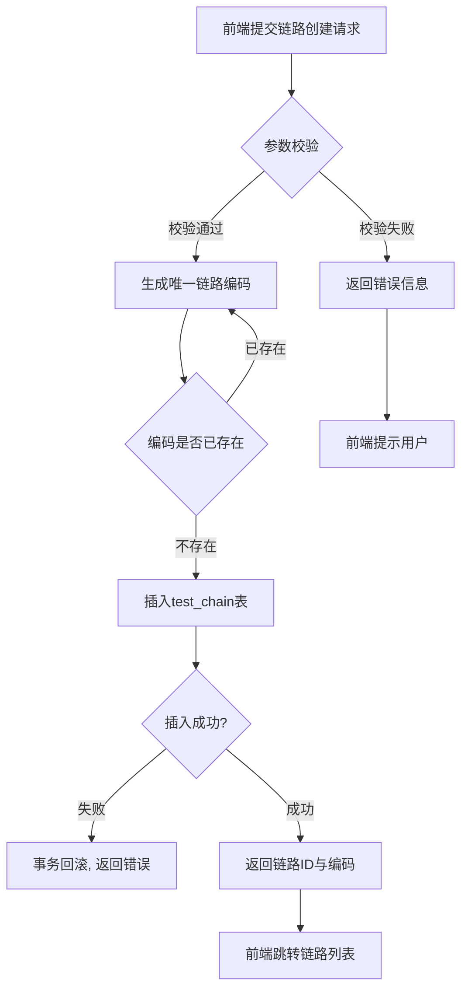
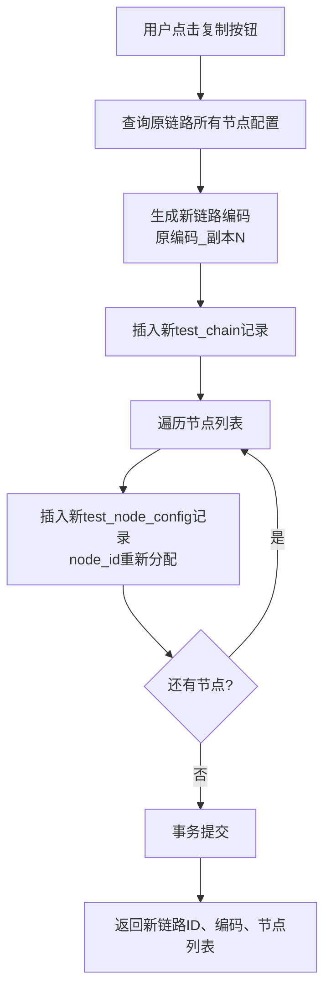
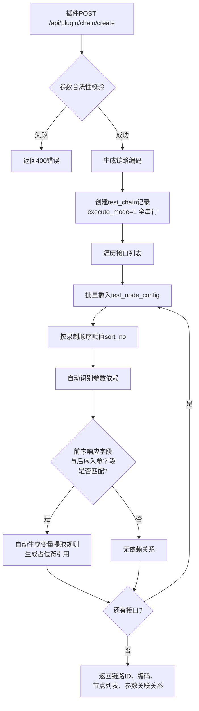
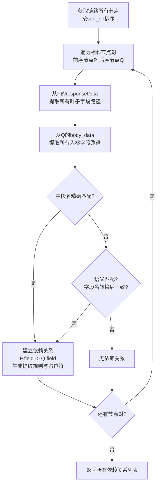
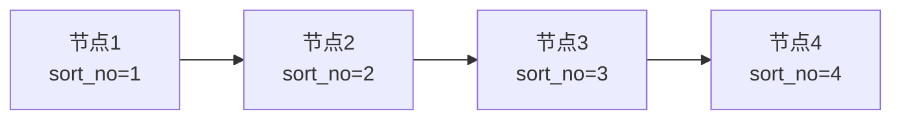
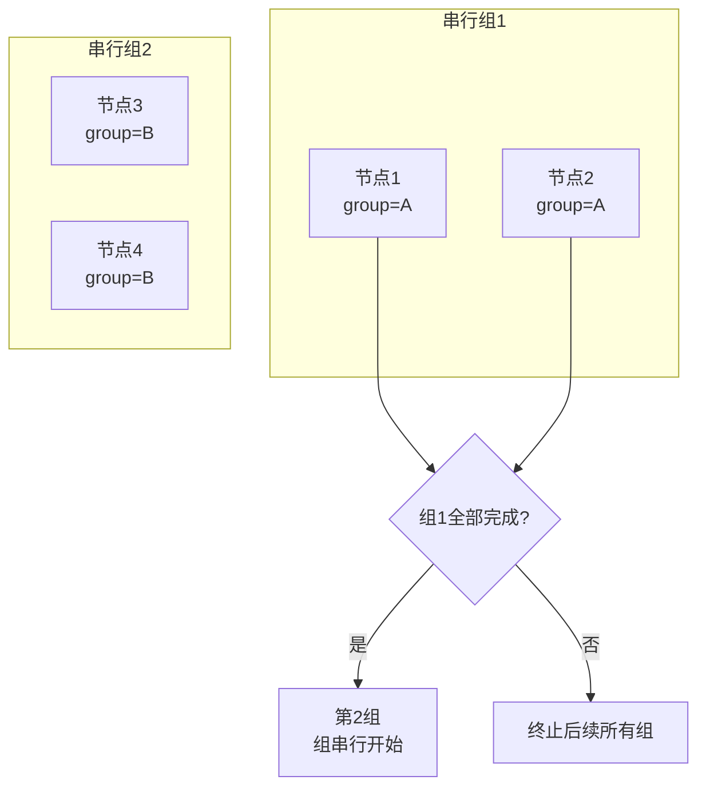

# 详细设计文档 v1.0 - 测试链路管理模块

## 1. 模块概述

测试链路管理模块是平台的顶层业务单元，负责测试链路的增删改查、执行模式配置、链路复制与版本管理、以及浏览器插件新建链路等核心功能。一条链路对应一个完整的测试流程，所有节点配置作为链路模板存储于数据库。

---

## 2. 系统架构

```
┌─────────────────────────────────────────────────────────────┐
│                        前端可视化平台                        │
│  ┌───────────┐  ┌───────────┐  ┌───────────┐  ┌─────────┐ │
│  │ 链路列表  │  │ 新增/编辑 │  │ 链路复制  │  │ 筛选搜索│ │
│  └─────┬─────┘  └─────┬─────┘  └─────┬─────┘  └────┬────┘ │
│        └──────────────┴──────────────┴──────────────┘     │
└──────────────────────────┬────────────────────────────────┘
                           │ HTTP/REST API
┌──────────────────────────┴────────────────────────────────┐
│                     后端服务层                             │
│  ┌──────────────────────────────────────────────────┐    │
│  │              ChainController                      │    │
│  │  createChain | editChain | deleteChain | copyChain│    │
│  │  listChain | getChainDetail | pluginCreateChain  │    │
│  └───────────────────┬──────────────────────────────┘    │
│                      │                                    │
│  ┌───────────────────┴──────────────────────────────┐    │
│  │              ChainService                         │    │
│  │  业务逻辑: 编码生成 | 执行模式校验 | 依赖识别     │    │
│  └───────────────────┬──────────────────────────────┘    │
│                      │                                    │
│  ┌───────────────────┴──────────────────────────────┐    │
│  │              ChainMapper / NodeMapper             │    │
│  │  SQL: INSERT | UPDATE | DELETE | SELECT           │    │
│  └───────────────────┬──────────────────────────────┘    │
└──────────────────────────┬────────────────────────────────┘
                           │
┌──────────────────────────┴────────────────────────────────┐
│                      MySQL 5.7                           │
│  ┌──────────────┐  ┌──────────────────────────────────┐  │
│  │ test_chain   │  │ test_node_config                 │  │
│  └──────────────┘  └──────────────────────────────────┘  │
└───────────────────────────────────────────────────────────┘
```

---

## 3. 数据库设计

### 3.1 测试链路表 (test_chain)

| 字段名 | 类型 | 长度 | 必填 | 主键 | 默认值 | 说明 |
|--------|------|------|------|------|--------|------|
| id | BIGINT | - | 是 | 是 | AUTO_INCREMENT | 自增主键 |
| chain_code | VARCHAR | 64 | 是 | 否 | - | 链路编码（唯一索引） |
| chain_name | VARCHAR | 128 | 是 | 否 | - | 链路名称 |
| execute_mode | TINYINT | 1 | 是 | 否 | 1 | 执行模式: 1=全串行, 2=分组并行 |
| description | TEXT | - | 否 | 否 | - | 链路描述 |
| create_time | DATETIME | - | 是 | 否 | CURRENT_TIMESTAMP | 创建时间 |
| update_time | DATETIME | - | 是 | 否 | CURRENT_TIMESTAMP ON UPDATE | 更新时间 |
| create_by | VARCHAR | 64 | 否 | 否 | - | 创建人 |
| status | TINYINT | 1 | 否 | 否 | 1 | 状态: 1=启用, 0=禁用 |

**索引设计:**
- PRIMARY KEY (id)
- UNIQUE INDEX uk_chain_code (chain_code)
- INDEX idx_chain_name (chain_name)
- INDEX idx_execute_mode (execute_mode)
- INDEX idx_create_time (create_time)

### 3.2 测试节点配置表 (test_node_config)

| 字段名 | 类型 | 长度 | 必填 | 主键 | 说明 |
|--------|------|------|------|------|------|
| id | BIGINT | - | 是 | 是 | 自增主键 |
| chain_code | VARCHAR | 64 | 是 | 否 | 所属链路编码（外键关联） |
| node_id | BIGINT | - | 是 | 否 | 节点ID（自增） |
| node_code | VARCHAR | 64 | 是 | 否 | 节点编码（链路内唯一） |
| node_name | VARCHAR | 128 | 是 | 否 | 节点名称 |
| node_type | VARCHAR | 16 | 是 | 否 | 节点类型（本期仅HTTP） |
| sort_no | INT | - | 是 | 否 | 排序号 |
| parallel_group | VARCHAR | 32 | 否 | 否 | 并行分组标识 |
| request_url | TEXT | - | 是 | 否 | 请求URL |
| request_method | VARCHAR | 10 | 是 | 否 | 请求方法（GET/POST/PUT/DELETE） |
| request_headers | LONGTEXT | - | 否 | 否 | 请求头（JSON格式） |
| body_type | VARCHAR | 32 | 否 | 否 | 请求体类型 |
| body_data | LONGTEXT | - | 否 | 否 | 请求体内容 |
| extract_rules | LONGTEXT | - | 否 | 否 | 变量提取规则（JSON） |
| assert_rules | LONGTEXT | - | 否 | 否 | 断言规则（JSON） |
| variable_mapping | LONGTEXT | - | 否 | 否 | 变量占位符映射（JSON） |
| create_time | DATETIME | - | 是 | 否 | 创建时间 |
| update_time | DATETIME | - | 是 | 否 | 更新时间 |

**索引设计:**
- PRIMARY KEY (id)
- UNIQUE INDEX uk_chain_node_code (chain_code, node_code)
- INDEX idx_chain_code (chain_code)
- INDEX idx_sort_no (chain_code, sort_no)

---

## 4. 核心流程设计

### 4.1 链路创建流程



**编码生成规则:**
- 格式: `CHAIN_` + 8位时间戳后6位 + 4位随机数
- 示例: `CHAIN_240612A3F7B2E1`
- 生成后查询唯一索引校验，冲突则重新生成

### 4.2 链路复制流程



### 4.3 插件新建链路流程



### 4.4 参数依赖自动识别算法



**语义匹配规则:**
- 下划线转驼峰: `order_id` <-> `orderId`
- 驼峰转下划线: `orderId` <-> `order_id`
- 大小写不敏感比较
- 支持常见缩写映射

---

## 5. API接口设计

### 5.1 链路管理接口列表

| 接口路径 | 方法 | 说明 | 权限 |
|----------|------|------|------|
| /api/chain/create | POST | 新建测试链路 | 普通用户 |
| /api/chain/edit | POST | 编辑测试链路 | 普通用户 |
| /api/chain/delete | POST | 删除测试链路 | 管理员 |
| /api/chain/list | GET | 分页查询链路列表 | 普通用户 |
| /api/chain/detail | GET | 获取链路详情 | 普通用户 |
| /api/chain/copy | POST | 复制测试链路 | 普通用户 |
| /api/plugin/chain/create | POST | 插件推送新建链路 | 插件专用 |
| /api/plugin/chain/append | POST | 插件追加至现有链路 | 插件专用 |

### 5.2 接口详情

**POST /api/chain/create**

请求参数:
```json
{
  "chainName": "用户注册全流程测试",
  "chainCode": "CHAIN_USER_REGISTER_V1",
  "executeMode": 1,
  "description": "覆盖用户注册、登录、信息完善全链路"
}
```

响应:
```json
{
  "code": 200,
  "message": "success",
  "data": {
    "chainId": 1001,
    "chainCode": "CHAIN_240612A3F7B2E1"
  }
}
```

**POST /api/chain/copy**

请求参数:
```json
{
  "chainCode": "CHAIN_USER_REGISTER_V1"
}
```

响应:
```json
{
  "code": 200,
  "data": {
    "newChainId": 1002,
    "newChainCode": "CHAIN_USER_REGISTER_V1_副本1",
    "nodeCount": 5
  }
}
```

---

## 6. 执行模式设计

### 6.1 全串行模式



- 所有节点按 sort_no 从小到大依次执行
- 前序节点失败，后续所有节点标记为「跳过」
- 无并行分组标识（parallel_group 为空）

### 6.2 分组并行模式



- 同 parallel_group 标识的节点并行执行
- 组与组之间按组内最小 sort_no 串行排序
- 单组内任意节点失败，标记本组失败，终止后续所有组

---

## 7. 异常处理

| 异常场景 | 处理方式 | 返回码 |
|----------|----------|--------|
| 链路编码已存在 | 拒绝创建，提示编码冲突 | 409 |
| 删除链路但节点被引用 | 级联删除关联节点 | 200 |
| 插件推送数据格式错误 | 拒绝写入，返回具体错误 | 400 |
| 数据库写入失败 | 事务回滚，返回500 | 500 |
| 参数依赖识别失败 | 降级为无依赖关系，不中断流程 | 200 + 警告 |

---

## 8. 关键技术点

### 8.1 JDK 8 兼容性

- 不使用 Java 9+ 的 var、switch表达式、records 等语法
- 使用 `java.util.Date` 和 `java.sql.Timestamp` 做时间处理
- JSON 序列化使用 Fastjson（与 LangChain4j 0.35.0 兼容）

### 8.2 事务管理

```java
@Transactional(rollbackFor = Exception.class)
public ChainVO createChain(ChainCreateDTO dto) {
    // 1. 生成并校验链路编码
    String chainCode = generateChainCode();
    
    // 2. 插入test_chain
    testChainMapper.insert(buildChain(dto, chainCode));
    
    // 3. 批量插入节点（插件场景）
    if (dto.getNodeList() != null) {
        batchInsertNodes(dto.getNodeList(), chainCode);
    }
    
    return buildChainVO(chainCode);
}
```

### 8.3 参数依赖识别

- 递归提取 JSON 响应中的所有叶子字段路径
- 与后续节点请求体字段做精确匹配和语义匹配
- 匹配成功后自动注入提取规则和占位符

---

## 9. 测试要点

1. 链路创建、编辑、删除、复制的CRUD完整性
2. 链路编码唯一性校验
3. 删除链路时节点级联删除验证
4. 插件新建链路的参数依赖自动识别准确性
5. 全串行和分组并行两种执行模式的正确性
6. 链路复制后节点node_id重新分配的正确性
7. 数据库事务回滚机制验证
