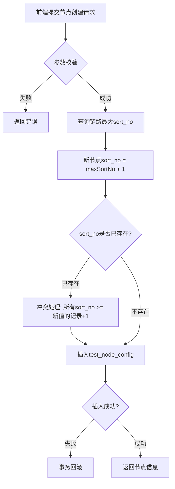
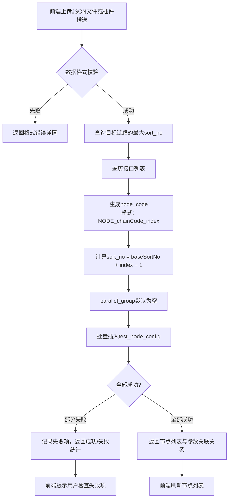
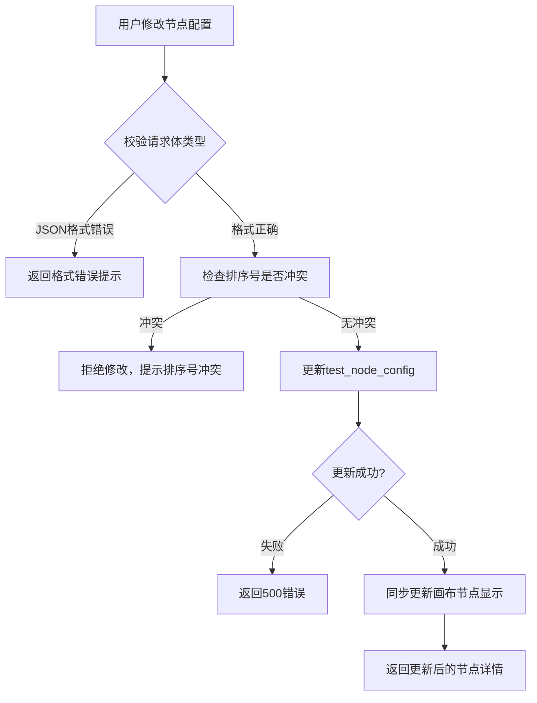

# 详细设计文档 v1.0 - 测试节点配置模块

## 1. 模块概述

测试节点配置模块是链路的最小执行单元，对应一次HTTP接口请求。所有节点配置构成链路测试模板，存储于数据库。模块负责节点的基础配置管理、排序与分组规则、批量节点导入、以及单节点编辑等功能。

---

## 2. 系统架构

```
┌─────────────────────────────────────────────────────────────┐
│                     前端可视化平台                           │
│  ┌───────────┐  ┌───────────┐  ┌───────────┐  ┌─────────┐ │
│  │ 节点列表  │  │ 拖拽添加  │  │ 批量导入  │  │ 单节点编辑││
│  └─────┬─────┘  └─────┬─────┘  └─────┬─────┘  └────┬────┘ │
│        └──────────────┴──────────────┴──────────────┘     │
└──────────────────────────┬────────────────────────────────┘
                           │ HTTP/REST API
┌──────────────────────────┴────────────────────────────────┐
│                     后端服务层                             │
│  ┌──────────────────────────────────────────────────┐    │
│  │           NodeConfigController                    │    │
│  │  createNode | editNode | deleteNode | importNodes│    │
│  │  listNodes | getNodeDetail | validateJSON        │    │
│  └───────────────────┬──────────────────────────────┘    │
│                      │                                    │
│  ┌───────────────────┴──────────────────────────────┐    │
│  │              NodeConfigService                    │    │
│  │  业务逻辑: 排序号分配 | 分组校验 | JSON格式化     │    │
│  └───────────────────┬──────────────────────────────┘    │
│                      │                                    │
│  ┌───────────────────┴──────────────────────────────┐    │
│  │              NodeConfigMapper                     │    │
│  │  SQL: INSERT | UPDATE | DELETE | SELECT           │    │
│  └───────────────────┬──────────────────────────────┘    │
└──────────────────────────┬────────────────────────────────┘
                           │
┌──────────────────────────┴────────────────────────────────┐
│                      MySQL 5.7                           │
│  ┌──────────────────────────────────────────────────┐    │
│  │              test_node_config                     │    │
│  └──────────────────────────────────────────────────┘    │
└───────────────────────────────────────────────────────────┘
```

---

## 3. 数据库设计

### 3.1 测试节点配置表 (test_node_config)

| 字段名 | 类型 | 长度 | 必填 | 主键 | 说明 |
|--------|------|------|------|------|------|
| id | BIGINT | - | 是 | 是 | 自增主键 |
| chain_code | VARCHAR | 64 | 是 | 否 | 所属链路编码（外键关联） |
| node_id | BIGINT | - | 是 | 否 | 节点ID（自增） |
| node_code | VARCHAR | 64 | 是 | 否 | 节点编码（链路内唯一） |
| node_name | VARCHAR | 128 | 是 | 否 | 节点名称 |
| node_type | VARCHAR | 16 | 是 | 否 | 节点类型（本期仅HTTP） |
| sort_no | INT | - | 是 | 否 | 排序号（链路内唯一） |
| parallel_group | VARCHAR | 32 | 否 | 否 | 并行分组标识 |
| request_url | TEXT | - | 是 | 否 | 请求URL |
| request_method | VARCHAR | 10 | 是 | 否 | 请求方法 |
| request_headers | LONGTEXT | - | 否 | 否 | 请求头（JSON格式） |
| body_type | VARCHAR | 32 | 否 | 否 | 请求体类型 |
| body_data | LONGTEXT | - | 否 | 否 | 请求体内容 |
| extract_rules | LONGTEXT | - | 否 | 否 | 变量提取规则（JSON） |
| assert_rules | LONGTEXT | - | 否 | 否 | 断言规则（JSON） |
| variable_mapping | LONGTEXT | - | 否 | 否 | 变量占位符映射（JSON） |
| create_time | DATETIME | - | 是 | 否 | 创建时间 |
| update_time | DATETIME | - | 是 | 否 | 更新时间 |

**索引设计:**
- PRIMARY KEY (id)
- UNIQUE INDEX uk_chain_node_code (chain_code, node_code)
- UNIQUE INDEX uk_chain_sort_no (chain_code, sort_no)
- INDEX idx_chain_code (chain_code)

---

## 4. 核心流程设计

### 4.1 节点创建与排序号分配



**排序号冲突处理算法:**
```java
// 伪代码
int maxSortNo = mapper.getMaxSortNo(chainCode);
int newSortNo = maxSortNo + 1;

// 检查冲突（并发场景）
if (mapper.existsSortNo(chainCode, newSortNo)) {
    // 将冲突及之后的排序号全部上移
    mapper.incrementSortNoFrom(chainCode, newSortNo);
}
```

### 4.2 批量节点导入流程



### 4.3 单节点编辑流程



### 4.4 变量提取与占位符映射

```mermaid
flowchart TD
    A[节点配置包含extract_rules] --> B{规则类型}
    B -->|JSONPath| C[从响应中提取指定路径值]
    B -->|正则| D[从响应中提取匹配值]
    B -->|固定值| E[使用固定值]
    C --> F{提取成功?}
    D --> F
    E --> G[存入执行上下文变量Map]
    F -->|成功| G
    F -->|失败| H[变量未设置，占位符不替换]
    G --> I[后续节点${变量名}替换为真实值]
    H --> J[后续节点${变量名}保持原样或报错]
```

**提取规则JSON格式:**
```json
{
  "rules": [
    {
      "varName": "userId",
      "jsonPath": "$.data.id",
      "description": "从用户创建响应中提取用户ID"
    },
    {
      "varName": "token",
      "jsonPath": "$.data.token",
      "description": "从登录响应中提取认证Token"
    }
  ]
}
```

**占位符引用格式:**
```json
{
  "bodyData": {
    "userId": "${userId}",
    "token": "${token}",
    "name": "测试用户"
  }
}
```

---

## 5. API接口设计

### 5.1 节点管理接口列表

| 接口路径 | 方法 | 说明 | 权限 |
|----------|------|------|------|
| /api/node/create | POST | 新建节点 | 普通用户 |
| /api/node/edit | POST | 编辑节点 | 普通用户 |
| /api/node/delete | POST | 删除节点 | 普通用户 |
| /api/node/list | GET | 查询链路节点列表 | 普通用户 |
| /api/node/detail | GET | 获取节点详情 | 普通用户 |
| /api/node/import | POST | 批量导入节点 | 普通用户 |
| /api/node/validate | POST | JSON格式化校验 | 普通用户 |

### 5.2 接口详情

**POST /api/node/import**

请求参数:
```json
{
  "chainCode": "CHAIN_USER_REGISTER_V1",
  "interfaces": [
    {
      "nodeName": "用户注册",
      "method": "POST",
      "url": "http://10.0.0.1/api/user/register",
      "headers": "{\"Content-Type\":\"application/json\"}",
      "bodyData": "{\"name\":\"test\",\"phone\":\"13800138000\"}",
      "responseData": "{\"code\":200,\"data\":{\"id\":1001}}"
    }
  ]
}
```

响应:
```json
{
  "code": 200,
  "data": {
    "successCount": 3,
    "failCount": 0,
    "nodes": [
      {
        "nodeCode": "NODE_REGISTER_1",
        "nodeId": 1,
        "sortNo": 1
      }
    ]
  }
}
```

---

## 6. 排序与分组规则

### 6.1 排序号规则

- 排序号为正整数，从1开始递增
- 同链路内排序号唯一
- 节点执行优先级: sort_no 越小越先执行
- 删除节点后，后续节点排序号不自动重排（保留人工编排顺序）

### 6.2 并行分组规则

| 场景 | parallel_group | 执行方式 |
|------|----------------|----------|
| 串行节点 | 空字符串或null | 按sort_no串行执行 |
| 同组节点 | 相同非空值 | 组内并行，组间串行 |
| 分组嵌套 | 不允许 | 校验时拒绝 |

**分组校验逻辑:**
```java
public void validateParallelGroups(List<NodeConfig> nodes) {
    Map<String, List<NodeConfig>> groups = nodes.stream()
        .filter(n -> StringUtils.isNotBlank(n.getParallelGroup()))
        .collect(Collectors.groupingBy(NodeConfig::getParallelGroup));
    
    for (Map.Entry<String, List<NodeConfig>> entry : groups.entrySet()) {
        // 检查组内节点sort_no是否重复
        Set<Integer> sortNos = entry.getValue().stream()
            .map(NodeConfig::getSortNo).collect(Collectors.toSet());
        if (sortNos.size() != entry.getValue().size()) {
            throw new BusinessException("同组内排序号不能重复");
        }
    }
    
    // 检查分组嵌套（一个节点不能同时属于两个分组）
    Set<String> allGroups = nodes.stream()
        .map(NodeConfig::getParallelGroup)
        .filter(g -> StringUtils.isNotBlank(g))
        .collect(Collectors.toSet());
    if (allGroups.size() != nodes.stream()
        .filter(n -> StringUtils.isNotBlank(n.getParallelGroup()))
        .count()) {
        throw new BusinessException("存在分组嵌套，不允许嵌套分组");
    }
}
```

---

## 7. 请求体类型支持

| 类型标识 | 说明 | 处理方式 |
|----------|------|----------|
| application/json | JSON格式 | 解析为JSONObject，支持JSONPath提取 |
| application/x-www-form-urlencoded | 表单格式 | 解析为键值对Map |
| multipart/form-data | 文件上传 | 标记为二进制数据，不做格式化 |
| text/plain | 纯文本 | 原样传递 |
| 其他 | 未知类型 | 原样传递，记录警告日志 |

---

## 8. 异常处理

| 异常场景 | 处理方式 | 返回码 |
|----------|----------|--------|
| 排序号冲突 | 自动上移冲突排序号 | 200 + 警告 |
| JSON格式错误 | 拒绝保存，返回具体错误位置 | 400 |
| 节点编码重复 | 拒绝创建，提示编码冲突 | 409 |
| 并行分组嵌套 | 拒绝保存，提示分组错误 | 400 |
| 链路不存在 | 拒绝操作 | 404 |
| 数据库写入失败 | 事务回滚 | 500 |

---

## 9. 关键技术点

### 9.1 JSONPath 变量提取

- 使用 Jayway JSONPath 库（兼容 JDK 8）
- 支持路径: `$`、`$.data`、`$.data.id`、`$.data[*].id`
- 支持通配符 `*` 和索引 `[n]`
- 提取失败时记录警告，不中断流程

### 9.2 变量占位符替换

- 格式: `${变量名}`
- 执行前扫描所有节点的 body_data 和 request_url
- 将占位符替换为执行上下文中的变量值
- 替换失败的占位符在运行时报错

### 9.3 并发安全

- 排序号分配使用数据库行级锁: `SELECT MAX(sort_no) FROM test_node_config WHERE chain_code = ? FOR UPDATE`
- 节点编码生成使用唯一索引约束

---

## 10. 测试要点

1. 节点创建、编辑、删除的CRUD完整性
2. 排序号分配与冲突处理的正确性
3. 批量导入节点时排序号顺延的正确性
4. JSON格式校验的准确性
5. 变量提取规则（JSONPath）的解析正确性
6. 占位符 `${变量名}` 替换的正确性
7. 并行分组校验（不允许嵌套）的正确性
8. 不同请求体类型的处理正确性
9. 并发创建节点时排序号冲突的线程安全性
