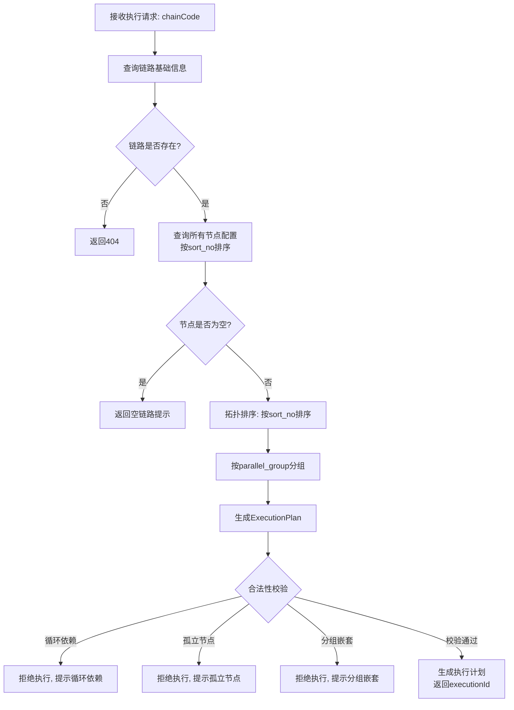
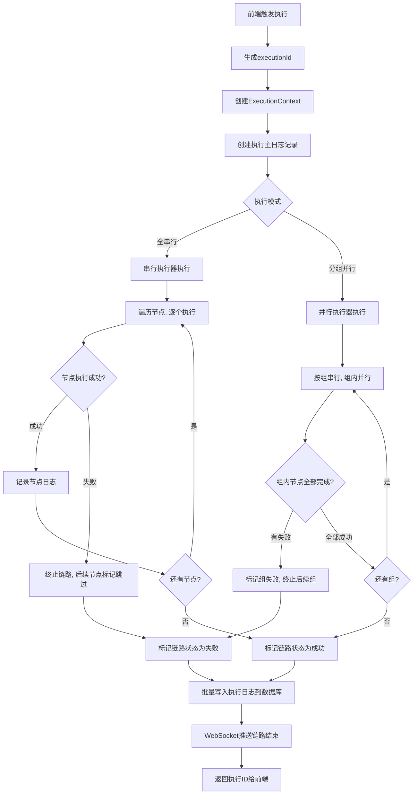
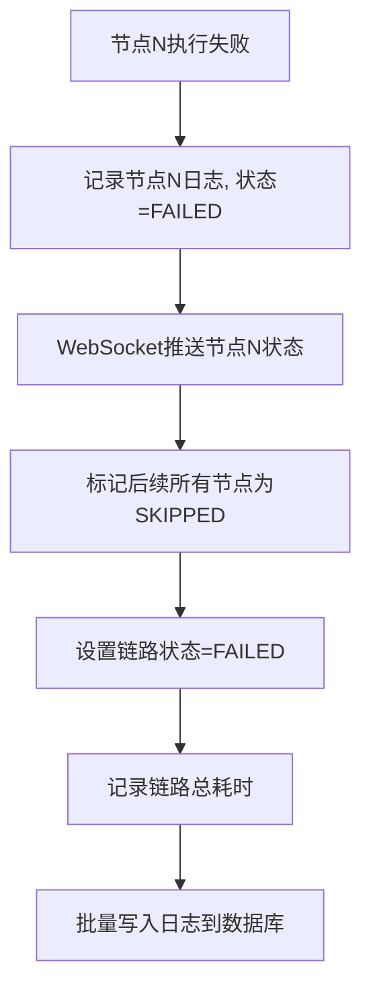
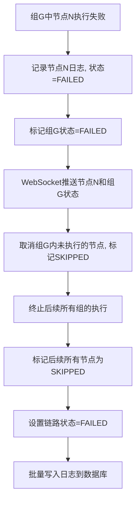

# 详细设计文档 v1.0 - 自研流程执行引擎模块

## 1. 模块概述

自研流程执行引擎是平台的核心模块，负责解析测试链路、生成执行计划、异步执行节点、管理执行上下文、处理异常中断。该模块替代专业流程引擎，覆盖90%以上接口测试场景，支持全串行和分组并行两种执行模式。

---

## 2. 系统架构

```
┌─────────────────────────────────────────────────────────────┐
│                     前端可视化平台                           │
│  ┌──────────────────────────────────────────────────────┐  │
│  │  点击「执行」按钮 → 发起HTTP请求 → 等待WebSocket推送  │  │
│  └──────────────────────────────────────────────────────┘  │
└──────────────────────────┬────────────────────────────────┘
                           │ HTTP POST /api/execute/run
┌──────────────────────────┴────────────────────────────────┐
│                     后端服务层                             │
│  ┌──────────────────────────────────────────────────┐    │
│  │            ExecuteController                      │    │
│  │  runChain | stopChain | getExecuteStatus          │    │
│  └───────────────────┬──────────────────────────────┘    │
│                      │                                    │
│  ┌───────────────────┴──────────────────────────────┐    │
│  │            ExecuteService                         │    │
│  │  链路解析 | 拓扑排序 | 执行计划生成 | 异常处理    │    │
│  └───────────────────┬──────────────────────────────┘    │
│                      │                                    │
│  ┌───────────────────┴──────────────────────────────┐    │
│  │          ExecutionEngine (核心引擎)               │    │
│  │  串行执行器 | 并行执行器 | 上下文管理             │    │
│  └───────────────────┬──────────────────────────────┘    │
│                      │                                    │
│  ┌───────────────────┴──────────────────────────────┐    │
│  │          HttpExecutor (HTTP执行器)                │    │
│  │  发起HTTP请求 | 记录响应 | 提取变量 | 断言校验    │    │
│  └───────────────────┬──────────────────────────────┘    │
└──────────────────────────┬────────────────────────────────┘
                           │
┌──────────────────────────┴────────────────────────────────┐
│                  自定义线程池                              │
│  corePoolSize = CPU核数 x 2                               │
│  maxPoolSize = CPU核数 x 4                                │
│  queueCapacity = 200                                      │
│  rejectionPolicy = CallerRunsPolicy                       │
└───────────────────────────────────────────────────────────┘
```

---

## 3. 核心类设计

### 3.1 执行上下文 (ExecutionContext)

```java
public class ExecutionContext {
    private String executionId;           // 执行ID（UUID）
    private String chainCode;             // 链路编码
    private ConcurrentHashMap<String, Object> variables;  // 全局变量Map
    private List<NodeExecuteLog> nodeLogs;  // 节点日志列表
    private volatile boolean stopped;     // 是否已终止
    private Date startTime;               // 开始时间
    private Date endTime;                 // 结束时间
    private String status;                // 执行状态
}
```

**变量Map说明:**
- 使用 `ConcurrentHashMap` 保证多线程读写安全
- 变量名: 字符串，从节点提取规则生成
- 变量值: Object类型，支持String、Number、Boolean、Map、List

### 3.2 执行计划 (ExecutionPlan)

```java
public class ExecutionPlan {
    private String executionId;
    private String chainCode;
    private List<ExecutionGroup> groups;  // 执行组列表（串行顺序）
    private int totalNodes;               // 总节点数
}

public class ExecutionGroup {
    private String groupName;             // 分组标识（串行模式为空）
    private List<ExecuteNode> nodes;      // 组内节点列表
    private int groupSortNo;              // 组排序号（组内最小sort_no）
    private volatile boolean completed;   // 是否已完成
    private volatile boolean failed;      // 是否失败
}

public class ExecuteNode {
    private NodeConfig config;            // 节点配置
    private String nodeId;                // 节点ID
    private String status;                // 执行状态
    private Date startTime;
    private Date endTime;
    private long costMs;
    private String errorMessage;
}
```

### 3.3 节点执行日志 (NodeExecuteLog)

```java
public class NodeExecuteLog {
    private String executionId;
    private String nodeCode;
    private String nodeName;
    private String status;                // PENDING/RUNNING/SUCCESS/FAILED/SKIPPED
    private String requestUrl;
    private String requestMethod;
    private String requestHeaders;
    private String requestBody;
    private Integer responseCode;
    private String responseHeaders;
    private String responseBody;
    private long costMs;
    private String errorMessage;
    private Map<String, Object> extractedVars;  // 提取的变量
}
```

---

## 4. 核心流程设计

### 4.1 链路解析与执行计划生成



**拓扑排序算法:**
```java
public ExecutionPlan parseChain(String chainCode) {
    List<NodeConfig> nodes = nodeMapper.selectByChainCode(chainCode);
    Collections.sort(nodes, Comparator.comparing(NodeConfig::getSortNo));
    
    // 按parallel_group分组
    Map<String, List<NodeConfig>> groupMap = nodes.stream()
        .filter(n -> StringUtils.isNotBlank(n.getParallelGroup()))
        .collect(Collectors.groupingBy(NodeConfig::getParallelGroup));
    
    ExecutionPlan plan = new ExecutionPlan();
    plan.setExecutionId(UUID.randomUUID().toString().replace("-", ""));
    plan.setChainCode(chainCode);
    
    // 串行模式: 所有节点在一个组内
    if (groupMap.isEmpty()) {
        ExecutionGroup group = new ExecutionGroup();
        group.setGroupName("");
        group.setNodes(convertToExecuteNodes(nodes));
        plan.getGroups().add(group);
    } else {
        // 分组模式: 按组内最小sort_no排序组
        List<ExecutionGroup> groups = new ArrayList<>();
        for (Map.Entry<String, List<NodeConfig>> entry : groupMap.entrySet()) {
            ExecutionGroup group = new ExecutionGroup();
            group.setGroupName(entry.getKey());
            group.setGroupSortNo(
                entry.getValue().stream()
                    .mapToInt(NodeConfig::getSortNo).min().getAsInt()
            );
            group.setNodes(convertToExecuteNodes(entry.getValue()));
            groups.add(group);
        }
        groups.sort(Comparator.comparing(ExecutionGroup::getGroupSortNo));
        plan.setGroups(groups);
    }
    
    validatePlan(plan);
    return plan;
}
```

### 4.2 链路执行流程



### 4.3 单节点执行流程

```mermaid
flowchart TD
    A[执行单个节点] --> B[从ExecutionContext读取变量Map]
    B --> C[替换节点配置中的占位符<br/>${变量名} -> 真实值]
    C --> D{占位符替换失败?}
    D -->|是| E[记录错误, 节点状态=FAILED]
    D -->|否| F[发起HTTP请求]
    F --> G[记录请求参数、发起时间]
    G --> H[接收HTTP响应]
    H --> I[记录响应码、响应体、耗时]
    I --> J{有提取规则?}
    J -->|是| K[从响应中提取变量<br/>更新ExecutionContext.variables]
    J -->|否| L[跳过变量提取]
    K --> M{有断言规则?}
    L --> M
    M -->|是| N[校验断言是否通过]
    M -->|否| O[节点状态=SUCCESS]
    N -->|通过| O
    N -->|不通过| P[节点状态=FAILED<br/>记录断言失败信息]
    O --> Q[记录节点日志]
    P --> Q
    Q --> R[WebSocket推送节点状态]
    R --> S[返回节点执行结果]
    E --> S
```

### 4.4 变量占位符替换

```mermaid
flowchart TD
    A[读取节点body_data或request_url] --> B[正则匹配${变量名}]
    B --> C{找到占位符?}
    C -->|否| D[原样使用, 无需替换]
    C -->|是| E[从ExecutionContext.variables查找变量]
    E --> F{变量存在?}
    F -->|是| G[替换为变量真实值]
    F -->|否| H[保留占位符, 记录警告]
    G --> I{还有占位符?}
    H --> I
    I -->|是| B
    I -->|否| J[得到替换后的完整配置]
    D --> J
```

---

## 5. 线程池配置

### 5.1 线程池参数

| 参数 | 值 | 说明 |
|------|-----|------|
| corePoolSize | CPU核数 x 2 | 核心线程数，保持活跃 |
| maxPoolSize | CPU核数 x 4 | 最大线程数，队列满时创建 |
| queueCapacity | 200 | 有界队列长度 |
| keepAliveSeconds | 60 | 空闲线程存活时间 |
| rejectionPolicy | CallerRunsPolicy | 调用方运行，反压机制 |

### 5.2 线程池初始化

```java
@Bean
public ThreadPoolExecutor executeThreadPool() {
    int cpuCores = Runtime.getRuntime().availableProcessors();
    ThreadPoolExecutor pool = new ThreadPoolExecutor(
        cpuCores * 2,           // corePoolSize
        cpuCores * 4,           // maxPoolSize
        60,                     // keepAliveSeconds
        TimeUnit.SECONDS,
        new ArrayBlockingQueue<>(200),  // 有界队列
        new ThreadFactoryBuilder()
            .setNameFormat("execute-pool-%d")
            .build(),
        new ThreadPoolExecutor.CallerRunsPolicy()  // 拒绝策略
    );
    return pool;
}
```

---

## 6. 异常中断规则

### 6.1 串行模式异常处理



### 6.2 分组并行模式异常处理



### 6.3 全链路异常捕获

```java
public void executeNode(ExecuteNode node) {
    try {
        // 正常执行逻辑
        executeSingleNode(node);
    } catch (Exception e) {
        // 单个节点异常不影响其他执行链路
        node.setStatus("FAILED");
        node.setErrorMessage(ExceptionUtils.getMessage(e));
        log.error("节点执行异常: nodeCode={}, error={}", 
                  node.getNodeId(), e.getMessage(), e);
    } finally {
        // 无论成功失败，都要记录日志并推送状态
        recordNodeLog(node);
        pushNodeStatus(node);
    }
}
```

---

## 7. HTTP请求执行器

### 7.1 请求发起

```java
public NodeExecuteLog executeHttpRequest(NodeConfig config, 
                                          ExecutionContext context) {
    long startTime = System.currentTimeMillis();
    NodeExecuteLog log = new NodeExecuteLog();
    log.setNodeCode(config.getNodeCode());
    log.setStatus("RUNNING");
    log.setStartTime(new Date(startTime));
    log.setRequestUrl(config.getRequestUrl());
    log.setRequestMethod(config.getRequestMethod());
    log.setRequestHeaders(config.getRequestHeaders());
    log.setRequestBody(config.getBodyData());
    
    try {
        // 使用HttpClient发起请求（JDK 8兼容）
        HttpResponse response = httpClient.execute(buildHttpRequest(config));
        log.setResponseCode(response.getStatusCode());
        log.setResponseHeaders(response.getHeaders());
        log.setResponseBody(response.getBody());
    } catch (Exception e) {
        log.setErrorMessage(ExceptionUtils.getMessage(e));
        log.setStatus("FAILED");
        throw new ExecutionException("HTTP请求失败", e);
    }
    
    long costMs = System.currentTimeMillis() - startTime;
    log.setCostMs(costMs);
    
    // 变量提取
    extractVariables(config, log, context);
    // 断言校验
    validateAssertions(config, log);
    
    return log;
}
```

---

## 8. 关键技术点

### 8.1 JDK 8 兼容性

- 使用 `java.util.Date` 和 `java.sql.Timestamp` 做时间处理
- 使用 `java.util.concurrent` 包中的并发容器
- 不使用 Java 9+ 的 `VarHandle`、`StackWalker` 等新API

### 8.2 变量上下文线程安全

- 使用 `ConcurrentHashMap` 存储全局变量
- 并行节点读取变量时使用 `computeIfAbsent` 保证原子性
- 变量写入使用 `put` 操作，保证可见性

### 8.3 异步执行不阻塞

- 前端触发执行后，主线程立即创建执行记录、返回executionId
- 任务提交至自定义线程池后台异步执行
- 执行线程直接通过WebSocket推送状态，无需轮询

---

## 9. 测试要点

1. 全串行模式下节点按sort_no顺序执行的正确性
2. 分组并行模式下组内并行、组间串行的正确性
3. 串行模式下单节点失败后后续节点标记为跳过的正确性
4. 并行模式下单组失败后终止后续组执行的正确性
5. 变量占位符替换的正确性和线程安全性
6. 线程池有界队列满时的反压行为（CallerRunsPolicy）
7. 单节点异常不影响其他链路执行
8. WebSocket实时推送的及时性和准确性
9. 执行日志批量写入数据库的正确性和性能
10. 大链路（50节点）和小链路（3节点）的执行性能
