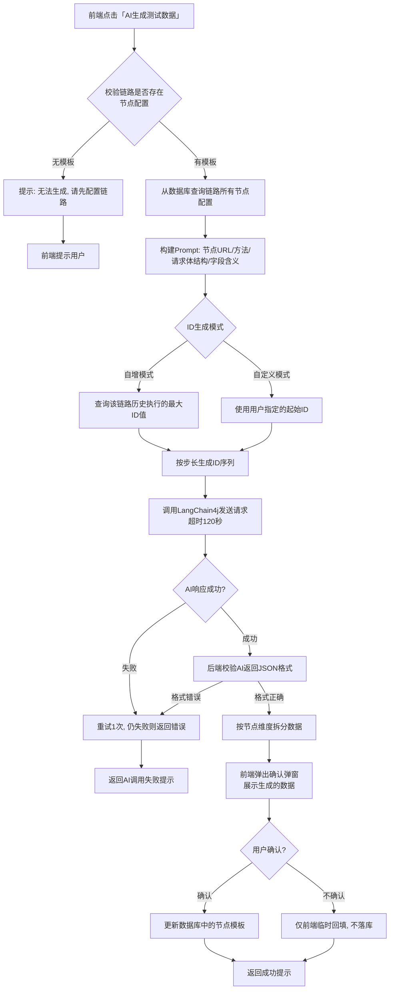
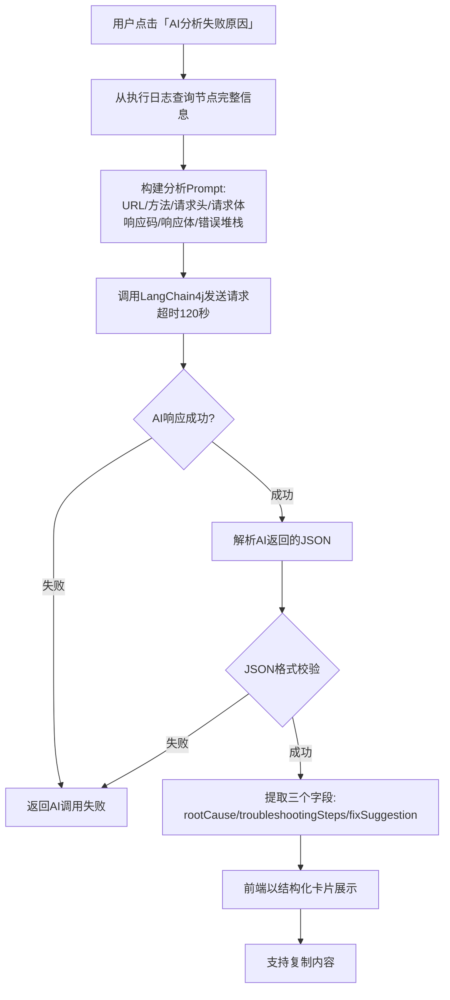

# 详细设计文档 v1.0 - AI智能服务模块

## 1. 模块概述

AI智能服务模块基于 LangChain4j 0.35.0（兼容JDK 8的最后一个稳定版本），对接内网兼容OpenAI协议的大模型服务。本期仅保留两个核心功能：全链路测试数据生成和执行失败智能分析。所有AI能力均基于已有链路配置模板生成，无模板不凭空生成。

---

## 2. 系统架构

```
┌─────────────────────────────────────────────────────────────┐
│                     前端可视化平台                           │
│  ┌───────────────┐  ┌───────────────┐                      │
│  │ AI生成测试数据 │  │ AI分析失败原因 │                      │
│  │ (编排页工具栏) │  │ (节点详情弹窗) │                      │
│  └───────┬───────┘  └───────┬───────┘                      │
└──────────┼──────────────────┼───────────────────────────────┘
           │                  │
           │   POST           │   POST
           │   /api/ai/data   │   /api/ai/analyze
           ▼                  ▼
┌─────────────────────────────────────────────────────────────┐
│                     后端AI服务层                             │
│  ┌──────────────────────────────────────────────────┐    │
│  │            AiController                           │    │
│  │  generateTestData | analyzeFailure                │    │
│  └───────────────────┬──────────────────────────────┘    │
│                      │                                    │
│  ┌───────────────────┴──────────────────────────────┐    │
│  │            AiService                              │    │
│  │  Prompt构建 | 模板组装 | 结果解析 | 格式校验     │    │
│  └───────────────────┬──────────────────────────────┘    │
│                      │                                    │
│  ┌───────────────────┴──────────────────────────────┐    │
│  │        LangChain4j AI Integration (0.35.0)        │    │
│  │  ChatLanguageModel | StreamingChatLanguageModel   │    │
│  └───────────────────┬──────────────────────────────┘    │
└──────────────────────────┬────────────────────────────────┘
                           │ OpenAI Compatible API
┌──────────────────────────┴────────────────────────────────┐
│                  内网大模型服务                            │
│  (兼容OpenAI协议, 超时默认120秒)                           │
└───────────────────────────────────────────────────────────┘
```

---

## 3. 核心类设计

### 3.1 AI服务配置 (AiConfig)

```java
public class AiConfig {
    private String baseUrl;             // 大模型服务地址
    private String apiKey;              // API密钥
    private String model;               // 模型名称
    private int timeoutSeconds;         // 超时时间（默认120）
    private int maxRetries;             // 最大重试次数（默认1）
    private String systemPrompt;        // 系统提示词
}
```

### 3.2 测试数据生成请求/响应

```java
// 请求
public class TestDataGenerateRequest {
    private String chainCode;           // 链路编码
    private String idGenerateMode;      // ID生成模式: AUTO_INCREMENT / CUSTOM
    private Integer idStep;             // ID步长（默认1，范围1-20）
    private Long customStartId;         // 自定义起始ID（自定义模式）
}

// 响应
public class TestDataGenerateResponse {
    private Map<String, Object> nodeData;  // 按节点维度生成的数据
    private String message;                 // 提示信息
}
```

### 3.3 失败分析请求/响应

```java
// 请求
public class FailureAnalyzeRequest {
    private String executionId;           // 执行ID
    private String nodeCode;              // 节点编码
}

// 响应
public class FailureAnalyzeResponse {
    private String rootCause;             // 根因定位
    private String troubleshootingSteps;  // 排查步骤
    private String fixSuggestion;         // 修复方案
}
```

---

## 4. 核心流程设计

### 4.1 全链路测试数据生成



### 4.2 Prompt构建详细设计

```
系统提示词:
┌─────────────────────────────────────────────────────────┐
│ 你是一个接口测试数据生成专家。基于以下链路配置模板，      │
│ 生成符合业务规则的测试数据。                              │
│ 要求:                                                   │
│ 1. 严格输出合法的JSON格式                                │
│ 2. 数字、字符串、日期、手机号、邮箱、身份证号等格式合法合规│
│ 3. 金额为正数，状态值符合枚举范围                          │
│ 4. 上下游依赖变量保持前后一致                              │
│ 5. 生成正向可用测试数据，兼顾边界值场景                    │
│ 6. ID生成策略: 模式={idMode}, 步长={step}, 起始值={startId}│
└─────────────────────────────────────────────────────────┘

用户Prompt:
┌─────────────────────────────────────────────────────────┐
│ 链路编码: CHAIN_XXX                                     │
│ 节点数量: 5                                             │
│                                                         │
│ 节点1:                                                  │
│   URL: http://10.0.0.1/api/user/create                  │
│   方法: POST                                            │
│   请求体: {"name":"", "phone":"", "email":""}           │
│                                                         │
│ 节点2:                                                  │
│   URL: http://10.0.0.1/api/order/create                 │
│   方法: POST                                            │
│   请求体: {"userId":"${userId}", "amount":""}           │
│                                                         │
│ ... (其他节点)                                          │
│                                                         │
│ 请为每个节点生成完整的请求体数据。                        │
└─────────────────────────────────────────────────────────┘
```

### 4.3 执行失败智能分析



### 4.4 失败分析Prompt构建

```
系统提示词:
┌─────────────────────────────────────────────────────────┐
│ 你是一个接口测试分析专家。根据传入的请求、响应、报错信息， │
│ 自动分析根因并给出修复建议。                              │
│ 输出格式必须为JSON:                                      │
│ {                                                      │
│   "rootCause": "根因定位",                              │
│   "troubleshootingSteps": "排查步骤",                    │
│   "fixSuggestion": "修复方案"                            │
│ }                                                      │
│ 分析维度: 参数格式错误/必填字段缺失/环境不可达/权限不足/  │
│           业务校验失败/服务端代码异常/依赖数据不存在        │
└─────────────────────────────────────────────────────────┘

用户Prompt:
┌─────────────────────────────────────────────────────────┐
│ 节点编码: NODE_REGISTER_1                               │
│ URL: http://10.0.0.1/api/user/create                    │
│ 方法: POST                                              │
│ 请求头: {"Content-Type": "application/json"}            │
│ 请求体: {"name":"", "phone":"", "email":""}             │
│ 响应码: 500                                             │
│ 响应内容: {"code":500,"msg":"用户已存在"}                │
│ 错误堆栈: NullPointerException at UserService.java:42   │
│                                                         │
│ 请分析失败根因并给出修复建议。                            │
└─────────────────────────────────────────────────────────┘
```

---

## 5. LangChain4j 集成设计

### 5.1 依赖配置

```xml
<!-- pom.xml -->
<dependency>
    <groupId>dev.langchain4j</groupId>
    <artifactId>langchain4j</artifactId>
    <version>0.35.0</version>
</dependency>
<dependency>
    <groupId>dev.langchain4j</groupId>
    <artifactId>langchain4j-open-ai</artifactId>
    <version>0.35.0</version>
</dependency>
```

### 5.2 ChatLanguageModel 初始化

```java
@Bean
public ChatLanguageModel chatLanguageModel(AiConfig config) {
    return OpenAiChatModel.builder()
        .apiKey(config.getApiKey())
        .baseUrl(config.getBaseUrl())
        .model(config.getModel())
        .timeout(Duration.ofSeconds(config.getTimeoutSeconds()))
        .logRequests(true)
        .logResponses(true)
        .build();
}
```

### 5.3 调用封装

```java
public String callModel(String systemPrompt, String userPrompt) {
    ChatLanguageModel model = chatLanguageModel();
    
    // 构造消息
    MessagesHelper.addSystemMessage(systemPrompt);
    MessagesHelper.addUserMessage(userPrompt);
    
    // 调用大模型
    AiMessage aiMessage = model.chat(messages);
    String response = aiMessage.text();
    
    // 格式校验（JSON）
    validateJsonFormat(response);
    
    return response;
}
```

---

## 6. API接口设计

### 6.1 AI服务接口列表

| 接口路径 | 方法 | 说明 | 权限 |
|----------|------|------|------|
| /api/ai/data/generate | POST | 全链路测试数据生成 | 普通用户 |
| /api/ai/failure/analyze | POST | 执行失败智能分析 | 普通用户 |
| /api/ai/config | GET | 获取AI配置信息 | 管理员 |
| /api/ai/config | POST | 更新AI配置 | 管理员 |

### 6.2 接口详情

**POST /api/ai/data/generate**

请求参数:
```json
{
  "chainCode": "CHAIN_USER_REGISTER_V1",
  "idGenerateMode": "AUTO_INCREMENT",
  "idStep": 1
}
```

响应:
```json
{
  "code": 200,
  "data": {
    "nodeData": {
      "NODE_REGISTER_1": {
        "bodyData": "{\"name\":\"测试用户001\",\"phone\":\"13800138001\",\"email\":\"test001@test.com\"}"
      },
      "NODE_LOGIN_2": {
        "bodyData": "{\"phone\":\"13800138001\",\"password\":\"Test1234\"}"
      }
    },
    "message": "测试数据生成成功，请确认后再保存"
  }
}
```

**POST /api/ai/failure/analyze**

请求参数:
```json
{
  "executionId": "exec_20240612_001",
  "nodeCode": "NODE_REGISTER_1"
}
```

响应:
```json
{
  "code": 200,
  "data": {
    "rootCause": "用户已存在: 请求体中phone字段「13800138001」对应的用户已在数据库中注册",
    "troubleshootingSteps": "1. 查询数据库确认该手机号是否已注册; 2. 检查业务逻辑是否正确处理重复注册场景; 3. 确认测试数据是否复用历史数据",
    "fixSuggestion": "方案1: 更换未注册的手机号; 方案2: 修改业务逻辑支持手机号复用测试; 方案3: 使用ID自增模式生成新手机号"
  }
}
```

---

## 7. 关键技术点

### 7.1 JDK 8 兼容性

- LangChain4j 0.35.0 是最后一个兼容 JDK 8 的版本
- 不使用 Java 9+ 的 DateTime API，使用 `java.util.Date`
- 超时控制使用 `Duration.ofSeconds()` 设置

### 7.2 超时控制

- 大模型调用超时默认120秒
- 超时后自动中断，记录超时日志
- 前端展示"AI调用超时，请稍后重试"

### 7.3 格式校验

- AI返回结果必须为合法JSON
- 后端使用Fastjson解析校验
- 格式错误时自动重试1次
- 重试仍失败则返回友好错误提示

### 7.4 无模板保护

- 生成测试数据前校验链路是否存在节点配置
- 无节点配置时直接拒绝，不调用AI
- 防止AI凭空生成无效数据

---

## 8. 异常处理

| 异常场景 | 处理方式 | 返回码 |
|----------|----------|--------|
| 大模型服务不可达 | 返回服务不可用提示 | 503 |
| 大模型调用超时（120秒） | 返回超时提示 | 408 |
| AI返回JSON格式错误 | 重试1次，仍失败返回错误 | 500 |
| 链路无节点配置 | 直接拒绝，不调用AI | 400 |
| 节点执行日志不存在 | 返回日志不存在 | 404 |
| AI配置未初始化 | 返回配置缺失提示 | 500 |

---

## 9. 测试要点

1. 全链路测试数据生成的JSON格式正确性
2. 自增模式和自定义模式ID生成的正确性
3. 上下游依赖变量的一致性保证
4. 失败分析三个字段（根因/排查步骤/修复方案）的完整性
5. 大模型调用超时的处理（120秒）
6. AI返回JSON格式错误的重试机制
7. 无模板时不调用AI的保护机制
8. 内网大模型服务不可达的降级处理
9. 敏感字段（密码、Token）的脱敏展示
