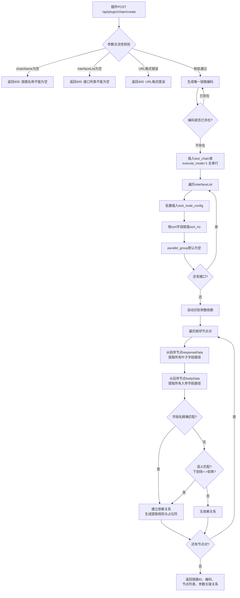
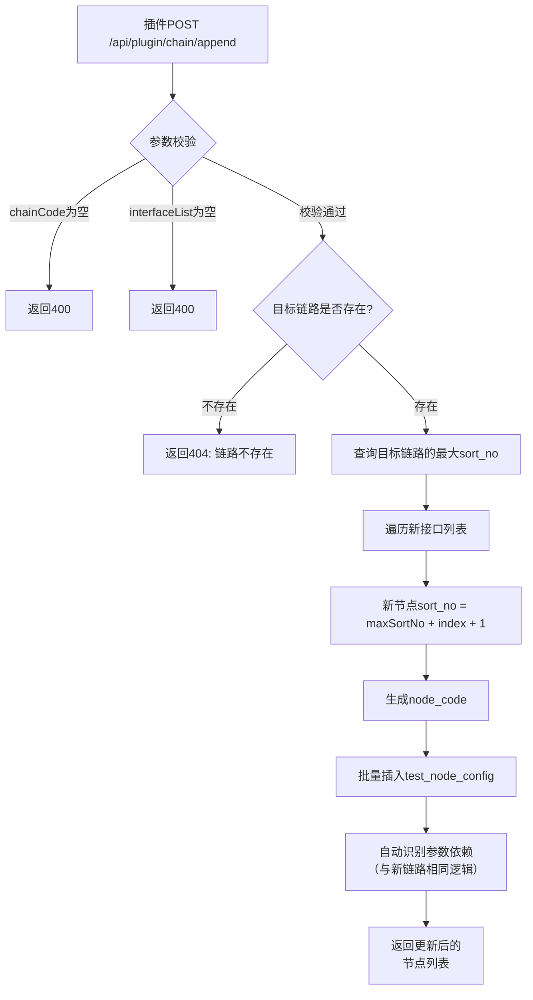
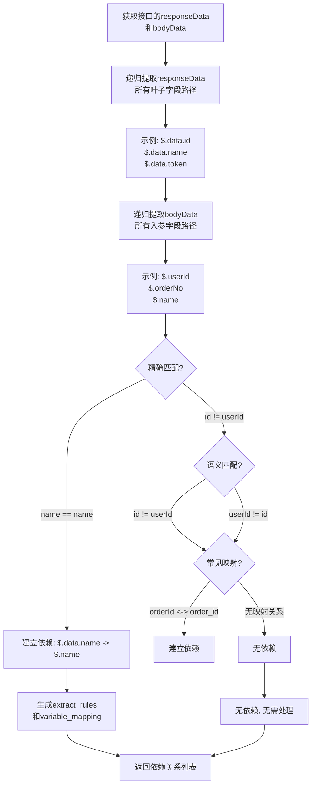

# 详细设计文档 v1.0 - 浏览器插件对接接口模块

## 1. 模块概述

浏览器插件专属对接接口模块为插件提供内网RESTful API，支持跨域调用，全程数据内网流转。包含三个核心接口: 插件推送新建链路、插件推送追加至现有链路、获取平台基础配置。模块负责接收插件推送的接口数据，自动创建或更新测试链路，并自动识别参数依赖关系。

---

## 2. 系统架构

```
┌─────────────────────────────────────────────────────────────┐
│                  浏览器插件 (Manifest V3)                    │
│  ┌──────────────────────────────────────────────────────┐  │
│  │  Popup界面: 录制控制 | 接口列表 | 筛选搜索            │  │
│  │  详情侧边栏: 请求/响应详情查看                        │  │
│  │  设置页: 平台地址配置                                 │  │
│  └──────────────────────────────────────────────────────┘  │
│                           │                                 │
│                    纯内网请求                               │
│                    无外网请求                             │
└──────────────────────────┬────────────────────────────────┘
                           │ POST /api/plugin/chain/create
                           │ POST /api/plugin/chain/append
                           │ GET  /api/plugin/config
┌──────────────────────────┴────────────────────────────────┐
│                     后端服务层                             │
│  ┌──────────────────────────────────────────────────┐    │
│  │          PluginController                         │    │
│  │  createChainByPlugin | appendChainByPlugin        │    │
│  │  getPluginConfig                                  │    │
│  └───────────────────┬──────────────────────────────┘    │
│                      │                                    │
│  ┌───────────────────┴──────────────────────────────┐    │
│  │          PluginService                            │    │
│  │  参数校验 | 依赖识别 | 编码生成 | 节点写入        │    │
│  └───────────────────┬──────────────────────────────┘    │
│                      │                                    │
│  ┌───────────────────┴──────────────────────────────┐    │
│  │          CrossOriginFilter (CORS过滤器)           │    │
│  │  允许插件跨域调用                                 │    │
│  └───────────────────────────────────────────────────┘    │
└──────────────────────────┬────────────────────────────────┘
                           │
┌──────────────────────────┴────────────────────────────────┐
│                      MySQL 5.7                           │
│  ┌──────────────┐  ┌──────────────────────────────────┐  │
│  │ test_chain   │  │ test_node_config                 │  │
│  └──────────────┘  └──────────────────────────────────┘  │
└───────────────────────────────────────────────────────────┘
```

---

## 3. 统一数据格式

插件推送、文件导入均采用以下JSON结构，两端严格对齐:

```json
{
  "chainName": "测试流程名称",
  "chainCode": "可选，追加时必填",
  "interfaceList": [
    {
      "nodeName": "节点名称",
      "method": "POST",
      "url": "http://内网IP/api/xxx",
      "headers": "{\"Content-Type\":\"application/json\"}",
      "bodyData": "{\"id\":123,\"name\":\"test\"}",
      "responseData": "{\"code\":200,\"data\":{\"id\":123}}",
      "sort": 1,
      "parallelGroup": ""
    }
  ]
}
```

**字段说明:**

| 字段 | 类型 | 必填 | 说明 |
|------|------|------|------|
| chainName | String | 是(新建) | 链路名称 |
| chainCode | String | 否(追加时必填) | 目标链路编码 |
| interfaceList | Array | 是 | 接口列表 |
| interfaceList[].nodeName | String | 是 | 节点名称 |
| interfaceList[].method | String | 是 | 请求方法 |
| interfaceList[].url | String | 是 | 请求URL |
| interfaceList[].headers | String | 否 | 请求头(JSON字符串) |
| interfaceList[].bodyData | String | 否 | 请求体(JSON字符串) |
| interfaceList[].responseData | String | 否 | 响应数据(JSON字符串) |
| interfaceList[].sort | Integer | 是 | 排序号 |
| interfaceList[].parallelGroup | String | 否 | 并行分组标识 |

---

## 4. 核心流程设计

### 4.1 插件推送新建链路



### 4.2 插件追加至现有链路



### 4.3 参数依赖自动识别算法



**语义匹配规则表:**

| 精确匹配 | 语义匹配(下划线转驼峰) | 语义匹配(驼峰转下划线) | 常见缩写映射 |
|----------|----------------------|----------------------|-------------|
| name = name | orderId = order_id | order_id = orderId | id <-> ID |
| userId = userId | userName = user_name | user_name = userName | no <-> No |
| token = token | createTime = create_time | create_time = createTime | url <-> URL |

---

## 5. API接口设计

### 5.1 插件接口列表

| 接口路径 | 方法 | 说明 | 权限 |
|----------|------|------|------|
| /api/plugin/chain/create | POST | 插件推送新建链路 | 插件专用 |
| /api/plugin/chain/append | POST | 插件追加至现有链路 | 插件专用 |
| /api/plugin/config | GET | 获取平台基础配置 | 插件专用 |

### 5.2 接口详情

**POST /api/plugin/chain/create**

请求示例:
```json
{
  "chainName": "用户注册登录全流程",
  "interfaceList": [
    {
      "nodeName": "用户注册",
      "method": "POST",
      "url": "http://10.0.0.1/api/user/register",
      "headers": "{\"Content-Type\":\"application/json\"}",
      "bodyData": "{\"name\":\"张三\",\"phone\":\"13800138000\"}",
      "responseData": "{\"code\":200,\"data\":{\"id\":1001,\"token\":\"abc123\"}}",
      "sort": 1,
      "parallelGroup": ""
    },
    {
      "nodeName": "用户登录",
      "method": "POST",
      "url": "http://10.0.0.1/api/user/login",
      "headers": "{\"Content-Type\":\"application/json\"}",
      "bodyData": "{\"phone\":\"13800138000\",\"password\":\"test123\"}",
      "responseData": "{\"code\":200,\"data\":{\"id\":1001,\"token\":\"def456\"}}",
      "sort": 2,
      "parallelGroup": ""
    }
  ]
}
```

响应示例:
```json
{
  "code": 200,
  "data": {
    "chainId": 1001,
    "chainCode": "CHAIN_240612A3F7B2E1",
    "nodeList": [
      {
        "nodeCode": "NODE_REGISTER_1",
        "nodeId": 1,
        "nodeName": "用户注册",
        "sortNo": 1
      },
      {
        "nodeCode": "NODE_LOGIN_2",
        "nodeId": 2,
        "nodeName": "用户登录",
        "sortNo": 2
      }
    ],
    "dependencyRelations": [
      {
        "fromNode": "NODE_REGISTER_1",
        "toNode": "NODE_LOGIN_2",
        "extractPath": "$.data.id",
        "targetPath": "$.phone",
        "matched": false
      }
    ]
  }
}
```

**POST /api/plugin/chain/append**

请求示例:
```json
{
  "chainCode": "CHAIN_USER_REGISTER_V1",
  "interfaceList": [
    {
      "nodeName": "信息查询",
      "method": "GET",
      "url": "http://10.0.0.1/api/user/info?id=1001",
      "sort": 3,
      "parallelGroup": ""
    }
  ]
}
```

响应示例:
```json
{
  "code": 200,
  "data": {
    "chainCode": "CHAIN_USER_REGISTER_V1",
    "totalNodes": 3,
    "newNodes": [
      {
        "nodeCode": "NODE_QUERY_3",
        "nodeId": 3,
        "sortNo": 3
      }
    ]
  }
}
```

**GET /api/plugin/config**

响应示例:
```json
{
  "code": 200,
  "data": {
    "methods": ["GET", "POST", "PUT", "DELETE"],
    "nodeTypes": ["HTTP"],
    "defaultBodyType": "application/json",
    "defaultParallelGroup": "",
    "maxInterfacesPerPush": 200
  }
}
```

---

## 6. CORS跨域配置

```java
@Configuration
public class CorsConfig implements WebMvcConfigurer {
    @Override
    public void addCorsMappings(CorsRegistry registry) {
        registry.addMapping("/api/plugin/**")
            .allowedOriginPatterns("*")           // 内网环境, 允许所有来源
            .allowedMethods("POST", "GET")
            .allowedHeaders("*")
            .allowCredentials(true)
            .maxAge(3600);
    }
}
```

---

## 7. 关键技术点

### 7.1 JDK 8 兼容性

- 使用 `java.util.Date` 做时间处理
- 使用 `javax.servlet` 做CORS配置
- JSON序列化使用Fastjson

### 7.2 跨域调用

- 插件运行在浏览器环境，天然跨域
- 后端配置CORS过滤器，允许插件域名访问
- 内网环境，不限制来源域名（可配置）

### 7.3 数据校验

- 链路上线前校验: chainName、interfaceList非空
- URL格式校验: 必须是http/https协议
- 请求体格式校验: JSON字符串必须合法
- 排序号校验: 必须为正整数

---

## 8. 异常处理

| 异常场景 | 处理方式 | 返回码 |
|----------|----------|--------|
| chainName为空 | 拒绝处理，返回提示信息 | 400 |
| interfaceList为空 | 拒绝处理，返回提示信息 | 400 |
| URL格式错误 | 拒绝处理，返回具体URL | 400 |
| JSON格式错误 | 拒绝处理，返回JSON解析错误位置 | 400 |
| 链路编码已存在 | 拒绝处理，提示编码冲突 | 409 |
| 目标链路不存在(追加) | 拒绝处理，提示链路不存在 | 404 |
| 数据库写入失败 | 事务回滚 | 500 |
| 参数依赖识别失败 | 降级为无依赖关系，不中断 | 200 + 警告 |

---

## 9. 测试要点

1. 插件推送新建链路的完整流程测试
2. 插件追加至现有链路的节点追加正确性
3. 参数依赖自动识别的准确性（精确匹配和语义匹配）
4. 排序号分配的连续性和唯一性
5. 跨域调用（CORS）的正确性
6. 大量接口（200条）推送的性能
7. 异常数据（格式错误、URL非法）的容错处理
8. 链路上线后节点级联删除验证
9. 重复推送相同数据的幂等性处理
