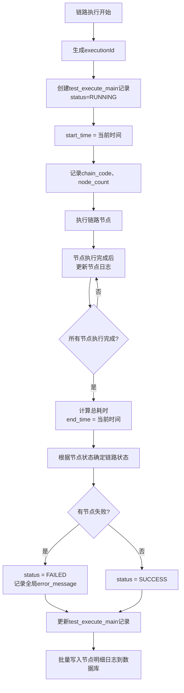
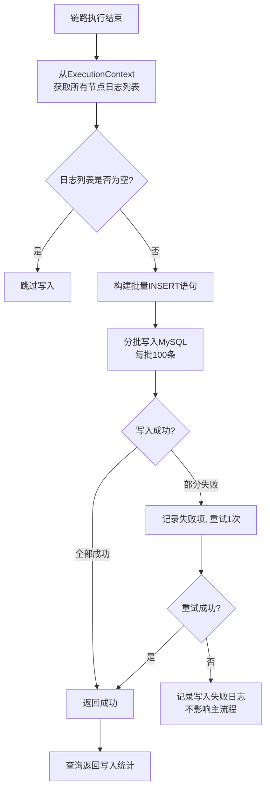
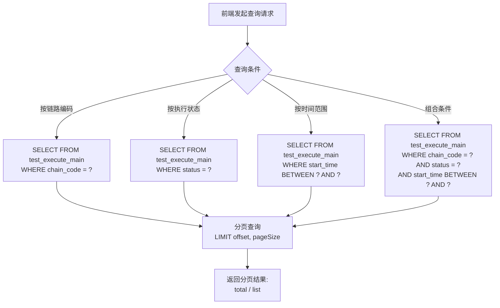
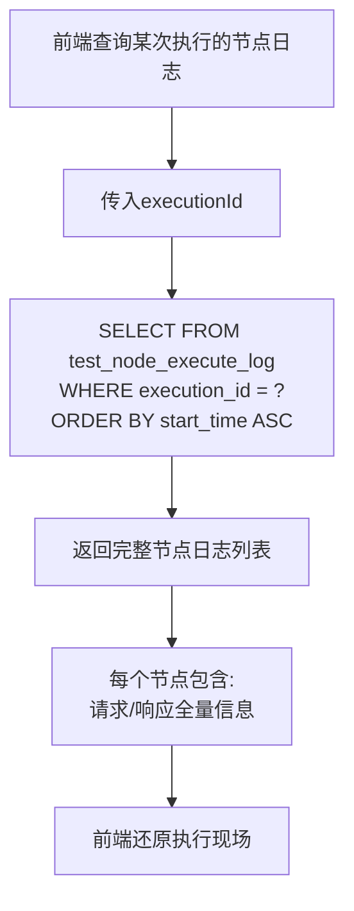

# 详细设计文档 v1.0 - 执行日志管理模块

## 1. 模块概述

执行日志管理模块负责记录和管理接口自动化测试的执行全过程。包含执行主日志（单次链路执行的整体信息）和节点明细日志（单次执行中每个节点的完整详情）两大核心功能。节点执行日志先暂存于执行上下文内存，整条链路执行结束后批量写入数据库，减少数据库IO开销。

---

## 2. 系统架构

```
┌─────────────────────────────────────────────────────────────┐
│                     前端可视化平台                           │
│  ┌──────────────────────────────────────────────────────┐  │
│  │  执行记录列表: 分页查询、筛选、查看详情                │  │
│  └──────────────────────────────────────────────────────┘  │
└──────────────────────────┬────────────────────────────────┘
                           │ HTTP/REST API
┌──────────────────────────┴────────────────────────────────┐
│                     后端服务层                             │
│  ┌──────────────────────────────────────────────────┐    │
│  │          LogController                            │    │
│  │  listMainLog | getMainDetail | listNodeLog        │    │
│  └───────────────────┬──────────────────────────────┘    │
│                      │                                    │
│  ┌───────────────────┴──────────────────────────────┐    │
│  │          LogService                               │    │
│  │  日志查询 | 分页 | 统计 | 批量写入                │    │
│  └───────────────────┬──────────────────────────────┘    │
│                      │                                    │
│  ┌───────────────────┴──────────────────────────────┐    │
│  │          LogMapper                                │    │
│  │  SQL: INSERT (批量) | SELECT (分页)               │    │
│  └───────────────────┬──────────────────────────────┘    │
└──────────────────────────┬────────────────────────────────┘
                           │
┌──────────────────────────┴────────────────────────────────┐
│                      MySQL 5.7                           │
│  ┌──────────────────────┐  ┌──────────────────────────┐  │
│  │ test_execute_main    │  │ test_node_execute_log    │  │
│  └──────────────────────┘  └──────────────────────────┘  │
└───────────────────────────────────────────────────────────┘
```

---

## 3. 数据库设计

### 3.1 执行主日志表 (test_execute_main)

| 字段名 | 类型 | 长度 | 必填 | 主键 | 说明 |
|--------|------|------|------|------|------|
| id | BIGINT | - | 是 | 是 | 自增主键 |
| execution_id | VARCHAR | 32 | 是 | 是 | 执行ID（唯一索引） |
| chain_code | VARCHAR | 64 | 是 | 否 | 关联链路编码 |
| status | VARCHAR | 16 | 是 | 否 | 执行状态: RUNNING/SUCCESS/FAILED |
| start_time | DATETIME | - | 是 | 否 | 开始时间 |
| end_time | DATETIME | - | 否 | 否 | 结束时间 |
| total_cost_ms | BIGINT | - | 否 | 否 | 总耗时（毫秒） |
| error_message | TEXT | - | 否 | 否 | 全局错误信息 |
| node_count | INT | - | 否 | 否 | 节点总数 |
| success_count | INT | - | 否 | 否 | 成功节点数 |
| fail_count | INT | - | 否 | 否 | 失败节点数 |
| skip_count | INT | - | 否 | 否 | 跳过节点数 |
| create_time | DATETIME | - | 是 | 否 | 创建时间 |
| update_time | DATETIME | - | 是 | 否 | 更新时间 |

**索引设计:**
- PRIMARY KEY (id)
- UNIQUE INDEX uk_execution_id (execution_id)
- INDEX idx_chain_code (chain_code)
- INDEX idx_status (status)
- INDEX idx_start_time (start_time)
- INDEX idx_chain_status (chain_code, status)

### 3.2 节点明细日志表 (test_node_execute_log)

| 字段名 | 类型 | 长度 | 必填 | 主键 | 说明 |
|--------|------|------|------|------|------|
| id | BIGINT | - | 是 | 是 | 自增主键 |
| execution_id | VARCHAR | 32 | 是 | 否 | 关联执行ID |
| node_code | VARCHAR | 64 | 是 | 否 | 节点编码 |
| node_name | VARCHAR | 128 | 否 | 否 | 节点名称 |
| status | VARCHAR | 16 | 是 | 否 | 执行状态 |
| request_url | TEXT | - | 否 | 否 | 请求URL |
| request_method | VARCHAR | 10 | 否 | 否 | 请求方法 |
| request_headers | LONGTEXT | - | 否 | 否 | 请求头 |
| request_body | LONGTEXT | - | 否 | 否 | 请求体 |
| response_code | INT | - | 否 | 否 | 响应码 |
| response_headers | LONGTEXT | - | 否 | 否 | 响应头 |
| response_body | LONGTEXT | - | 否 | 否 | 响应体 |
| cost_ms | BIGINT | - | 否 | 否 | 执行耗时（毫秒） |
| error_message | TEXT | - | 否 | 否 | 错误信息 |
| extracted_vars | LONGTEXT | - | 否 | 否 | 提取的变量（JSON） |
| start_time | DATETIME | - | 否 | 否 | 节点开始时间 |
| end_time | DATETIME | - | 否 | 否 | 节点结束时间 |
| create_time | DATETIME | - | 是 | 否 | 创建时间 |

**索引设计:**
- PRIMARY KEY (id)
- INDEX idx_execution_id (execution_id)
- INDEX idx_node_code (node_code)
- INDEX idx_execution_node (execution_id, node_code)

---

## 4. 核心流程设计

### 4.1 执行主日志创建与更新



### 4.2 节点日志批量写入



### 4.3 执行记录查询



### 4.4 节点明细日志查询



---

## 5. API接口设计

### 5.1 日志管理接口列表

| 接口路径 | 方法 | 说明 | 权限 |
|----------|------|------|------|
| /api/log/main/list | GET | 分页查询执行主日志 | 普通用户 |
| /api/log/main/detail | GET | 获取执行主日志详情 | 普通用户 |
| /api/log/node/list | GET | 查询某次执行的节点明细日志 | 普通用户 |
| /api/log/node/detail | GET | 获取单条节点日志详情 | 普通用户 |

### 5.2 接口详情

**GET /api/log/main/list**

请求参数:
```
chainCode=CHAIN_USER_REGISTER_V1
&status=FAILED
&startTime=2024-06-12 00:00:00
&endTime=2024-06-12 23:59:59
&pageNo=1
&pageSize=20
```

响应:
```json
{
  "code": 200,
  "data": {
    "total": 156,
    "pageNo": 1,
    "pageSize": 20,
    "list": [
      {
        "executionId": "exec_240612A3F7B2E1",
        "chainCode": "CHAIN_USER_REGISTER_V1",
        "chainName": "用户注册登录全流程",
        "status": "FAILED",
        "startTime": "2024-06-12 10:30:00",
        "endTime": "2024-06-12 10:30:15",
        "totalCostMs": 15234,
        "nodeCount": 5,
        "successCount": 3,
        "failCount": 1,
        "skipCount": 1
      }
    ]
  }
}
```

**GET /api/log/node/list**

请求参数:
```
executionId=exec_240612A3F7B2E1
```

响应:
```json
{
  "code": 200,
  "data": {
    "executionId": "exec_240612A3F7B2E1",
    "chainCode": "CHAIN_USER_REGISTER_V1",
    "status": "FAILED",
    "nodes": [
      {
        "nodeCode": "NODE_REGISTER_1",
        "nodeName": "用户注册",
        "status": "SUCCESS",
        "requestUrl": "http://10.0.0.1/api/user/register",
        "requestMethod": "POST",
        "requestBody": "{\"name\":\"张三\",\"phone\":\"13800138000\"}",
        "responseCode": 200,
        "responseBody": "{\"code\":200,\"data\":{\"id\":1001}}",
        "costMs": 2345,
        "startTime": "2024-06-12 10:30:00",
        "endTime": "2024-06-12 10:30:02"
      }
    ]
  }
}
```

---

## 6. 内存暂存与落库机制

### 6.1 内存暂存

```java
// ExecutionContext中维护节点日志列表
public class ExecutionContext {
    private List<NodeExecuteLog> nodeLogs = new CopyOnWriteArrayList<>();
    
    // 节点执行完成后添加到内存列表
    public void addNodeLog(NodeExecuteLog log) {
        nodeLogs.add(log);
    }
    
    // 获取所有节点日志
    public List<NodeExecuteLog> getNodeLogs() {
        return new ArrayList<>(nodeLogs);
    }
}
```

### 6.2 批量落库

```java
@Transactional(rollbackFor = Exception.class)
public void batchSaveNodeLogs(String executionId, List<NodeExecuteLog> logs) {
    if (logs == null || logs.isEmpty()) {
        return;
    }
    
    // 分批写入，每批100条
    int batchSize = 100;
    for (int i = 0; i < logs.size(); i += batchSize) {
        int end = Math.min(i + batchSize, logs.size());
        List<NodeExecuteLog> batch = logs.subList(i, end);
        nodeExecuteLogMapper.batchInsert(batch);
    }
}
```

**批量插入SQL:**
```sql
INSERT INTO test_node_execute_log
  (execution_id, node_code, node_name, status,
   request_url, request_method, request_headers, request_body,
   response_code, response_headers, response_body,
   cost_ms, error_message, extracted_vars,
   start_time, end_time, create_time)
VALUES
  (#{item.executionId}, #{item.nodeCode}, #{item.nodeName}, #{item.status},
   #{item.requestUrl}, #{item.requestMethod}, #{item.requestHeaders}, #{item.requestBody},
   #{item.responseCode}, #{item.responseHeaders}, #{item.responseBody},
   #{item.costMs}, #{item.errorMessage}, #{item.extractedVars},
   #{item.startTime}, #{item.endTime}, NOW())
```

---

## 7. 关键技术点

### 7.1 数据库字段类型选择

- LONGTEXT: 存储请求头、请求体、响应头、响应体等可能很长的JSON数据
- TEXT: 存储错误信息等中等长度文本
- 避免VARCHAR超长截断问题

### 7.2 内存暂存策略

- 使用 `CopyOnWriteArrayList` 保证并发安全
- 节点执行完成后立即添加到内存列表
- 链路执行结束后一次性批量写入数据库
- 减少数据库IO开销

### 7.3 分页查询优化

- 使用 `LIMIT offset, pageSize` 分页
- 大数据量时添加索引: `idx_chain_status`, `idx_start_time`
- 查询耗时: 单次执行节点日志查询 < 100ms

---

## 8. 异常处理

| 异常场景 | 处理方式 | 返回码 |
|----------|----------|--------|
| 执行ID不存在 | 返回空列表 | 200 (空) |
| 批量写入部分失败 | 重试1次，记录失败日志 | 200 (部分成功) |
| 数据库写入完全失败 | 不影响主流程，记录警告日志 | 200 |
| 分页参数异常 | 使用默认值 | 200 |
| 时间范围异常 | 返回空列表 | 200 (空) |

---

## 9. 测试要点

1. 执行主日志的创建、更新、查询完整性
2. 节点明细日志的内存暂存和批量落库正确性
3. 分页查询的性能（1000条记录 < 200ms）
4. 按链路、状态、时间范围组合查询的正确性
5. 大批量节点日志（50节点）批量写入的性能
6. 执行日志的保留策略（删除链路时保留历史日志）
7. 并发执行多条链路时日志不混淆
8. 敏感字段（密码、Token）在日志中的脱敏处理
