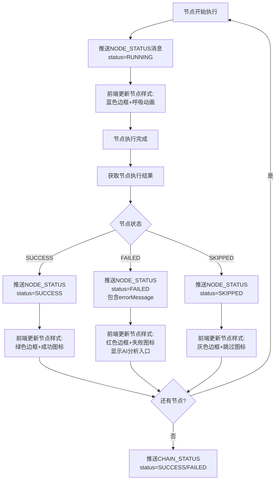
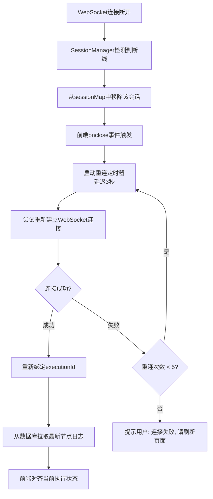

# 详细设计文档 v1.0 - WebSocket实时推送模块

## 1. 模块概述

WebSocket实时推送模块负责在执行过程中将节点状态实时回传给前端，实现执行过程全透明。模块管理WebSocket连接生命周期，在节点开始执行、节点执行完成、整条链路执行结束时推送状态信息。会话存储于服务本地内存，执行线程直接推送，无中间件中转。前端支持WebSocket断开后自动重连。

---

## 2. 系统架构

```
┌─────────────────────────────────────────────────────────────┐
│                     前端可视化平台                           │
│  ┌──────────────────────────────────────────────────────┐  │
│  │  进入执行页面时建立WebSocket连接                      │  │
│  │  绑定executionId, 监听节点状态推送                    │  │
│  │  节点悬停看摘要, 点击看详情, 失败一键AI分析           │  │
│  │  断线自动重连, 重连后拉取最新状态对齐                 │  │
│  └──────────────────────────────────────────────────────┘  │
└──────────────────────────┬────────────────────────────────┘
                           │ WebSocket (ws://)
┌──────────────────────────┴────────────────────────────────┐
│                     后端服务层                             │
│  ┌──────────────────────────────────────────────────┐    │
│  │        WebSocketConfig (Spring Boot)              │    │
│  │  @ServerEndpoint("/ws/execute/{executionId}")     │    │
│  └───────────────────┬──────────────────────────────┘    │
│                      │                                    │
│  ┌───────────────────┴──────────────────────────────┐    │
│  │        WebSocketSessionManager                    │    │
│  │  连接管理 | 会话存储 | 断线清理 | 重连处理        │    │
│  └───────────────────┬──────────────────────────────┘    │
│                      │                                    │
│  ┌───────────────────┴──────────────────────────────┐    │
│  │        WebSocketPushService                       │    │
│  │  推送节点状态 | 推送链路状态 | 消息格式封装       │    │
│  └───────────────────┬──────────────────────────────┘    │
└──────────────────────────┬────────────────────────────────┘
                           │
┌──────────────────────────┴────────────────────────────────┐
│                  本地内存会话存储                          │
│  ConcurrentHashMap<String, Set<WebSocketSession>>         │
│  key: executionId  value: 该执行ID的所有连接              │
└───────────────────────────────────────────────────────────┘
```

---

## 3. 核心类设计

### 3.1 WebSocket会话管理类

```java
@Component
public class WebSocketSessionManager {
    // executionId -> 该执行的WebSocket会话集合
    private ConcurrentHashMap<String, Set<Session>> sessionMap = 
        new ConcurrentHashMap<>();
    
    // 添加会话
    public void addSession(String executionId, Session session) {
        sessionMap.computeIfAbsent(executionId, k -> ConcurrentHashMap.newKeySet())
                  .add(session);
    }
    
    // 移除会话
    public void removeSession(String executionId, Session session) {
        Set<Session> sessions = sessionMap.get(executionId);
        if (sessions != null) {
            sessions.remove(session);
            if (sessions.isEmpty()) {
                sessionMap.remove(executionId);
            }
        }
    }
    
    // 获取指定执行的会话
    public Set<Session> getSessions(String executionId) {
        return sessionMap.get(executionId);
    }
    
    // 清理所有会话（服务关闭时）
    public void clearAll() {
        sessionMap.clear();
    }
}
```

### 3.2 WebSocket推送服务

```java
@Component
public class WebSocketPushService {
    @Autowired
    private WebSocketSessionManager sessionManager;
    
    // 推送节点状态
    public void pushNodeStatus(String executionId, NodeStatusMessage message) {
        Set<Session> sessions = sessionManager.getSessions(executionId);
        if (sessions != null && !sessions.isEmpty()) {
            String json = JSON.toJSONString(message);
            for (Session session : sessions) {
                if (session.isOpen()) {
                    session.getBasicRemote().sendText(json);
                }
            }
        }
    }
    
    // 推送链路状态
    public void pushChainStatus(String executionId, ChainStatusMessage message) {
        Set<Session> sessions = sessionManager.getSions(executionId);
        if (sessions != null && !sessions.isEmpty()) {
            String json = JSON.toJSONString(message);
            for (Session session : sessions) {
                if (session.isOpen()) {
                    session.getBasicRemote().sendText(json);
                }
            }
        }
    }
}
```

### 3.3 推送消息格式

**节点状态消息:**
```json
{
  "type": "NODE_STATUS",
  "executionId": "exec_240612A3F7B2E1",
  "nodeCode": "NODE_REGISTER_1",
  "nodeName": "用户注册",
  "status": "SUCCESS",
  "costMs": 2345,
  "responseCode": 200,
  "errorMessage": "",
  "timestamp": "2024-06-12T10:30:02"
}
```

**链路状态消息:**
```json
{
  "type": "CHAIN_STATUS",
  "executionId": "exec_240612A3F7B2E1",
  "chainCode": "CHAIN_USER_REGISTER_V1",
  "status": "SUCCESS",
  "totalCostMs": 15234,
  "nodeCount": 5,
  "successCount": 5,
  "failCount": 0,
  "skipCount": 0,
  "errorMessage": "",
  "timestamp": "2024-06-12T10:30:15"
}
```

**错误消息:**
```json
{
  "type": "ERROR",
  "executionId": "exec_240612A3F7B2E1",
  "message": "WebSocket推送失败: 连接已关闭"
}
```

---

## 4. 核心流程设计

### 4.1 WebSocket连接管理

```mermaid
flowchart TD
    A[前端进入执行页面] --> B[建立WebSocket连接<br/>ws://host/ws/execute/{executionId}]
    B --> C{连接成功?}
    C -->|失败| D[前端触发重连<br/>等待3秒后重试]
    C -->|成功| E[注册到SessionManager]
    E --> F[绑定executionId]
    F --> G[等待推送消息]
    D --> H{重连次数 > 5?}
    H -->|否| B
    H -->|是| I[提示用户: 连接失败, 请刷新页面]
```

### 4.2 节点状态推送



### 4.3 断线重连机制



---

## 5. Spring Boot WebSocket配置

### 5.1 WebSocket端点配置

```java
@Configuration
@EnableWebSocket
public class WebSocketConfig {
    @Bean
    public ServerEndpointExporter serverEndpointExporter() {
        return new ServerEndpointExporter();
    }
    
    @Bean
    public WebSocketService webSocketService() {
        return new WebSocketPushService();
    }
}
```

### 5.2 WebSocket服务端点

```java
@ServerEndpoint("/ws/execute/{executionId}")
@Component
public class ExecuteWebSocket {
    
    private Session session;
    private String executionId;
    
    @Autowired
    private WebSocketSessionManager sessionManager;
    
    @Autowired
    private WebSocketPushService pushService;
    
    @OnOpen
    public void onOpen(Session session, 
                       @PathParam("executionId") String executionId) {
        this.session = session;
        this.executionId = executionId;
        sessionManager.addSession(executionId, session);
    }
    
    @OnClose
    public void onClose() {
        sessionManager.removeSession(executionId, session);
    }
    
    @OnError
    public void onError(Session session, Throwable error) {
        log.error("WebSocket error: executionId={}, error={}", 
                  executionId, error.getMessage());
        sessionManager.removeSession(executionId, session);
    }
}
```

### 5.3 连接清理

```java
// 服务启动时注册清理监听器
@PostConstruct
public void init() {
    // 定时清理过期会话（超过24小时无活动的会话）
    ScheduledExecutorService scheduler = Executors.newSingleThreadScheduledExecutor();
    scheduler.scheduleAtFixedRate(() -> {
        long cutoff = System.currentTimeMillis() - 24 * 3600 * 1000;
        for (Map.Entry<String, Set<Session>> entry : sessionMap.entrySet()) {
            if (/* 会话已过期 */) {
                entry.getValue().clear();
                sessionMap.remove(entry.getKey());
            }
        }
    }, 3600, 3600, TimeUnit.SECONDS);
}
```

---

## 6. 关键技术点

### 6.1 本地内存会话存储

- 使用 `ConcurrentHashMap<String, Set<Session>>` 存储会话
- key: executionId, value: 该执行的所有WebSocket会话
- 无需Redis等中间件，完全本地化
- 服务重启后会话全部丢失（可接受，前端重连即可）

### 6.2 执行线程直接推送

- 执行引擎线程直接调用 `pushNodeStatus()` 推送状态
- 无需消息队列中转，降低延迟
- 推送失败时记录日志，不影响主流程

### 6.3 断线自动重连

- 前端 onclose 事件触发重连逻辑
- 使用指数退避策略: 3s, 6s, 12s, 24s, 48s
- 最多重试5次，超过后提示用户手动刷新
- 重连成功后从数据库拉取最新节点日志对齐状态

---

## 7. 前端WebSocket集成

### 7.1 前端连接管理

```javascript
// 前端WebSocket连接管理
class WebSocketManager {
  constructor(executionId) {
    this.executionId = executionId;
    this.reconnectAttempts = 0;
    this.maxReconnectAttempts = 5;
    this.reconnectDelay = 3000;
    this.listeners = {};
  }
  
  connect() {
    const wsUrl = `ws://${location.host}/ws/execute/${this.executionId}`;
    this.ws = new WebSocket(wsUrl);
    
    this.ws.onopen = () => {
      this.reconnectAttempts = 0;
      this.reconnectDelay = 3000;
    };
    
    this.ws.onmessage = (event) => {
      const message = JSON.parse(event.data);
      this.handleMessage(message);
    };
    
    this.ws.onclose = () => {
      this.handleReconnect();
    };
  }
  
  handleMessage(message) {
    if (message.type === 'NODE_STATUS') {
      this.updateNodeStatus(message);
    } else if (message.type === 'CHAIN_STATUS') {
      this.updateChainStatus(message);
    }
  }
  
  handleReconnect() {
    if (this.reconnectAttempts < this.maxReconnectAttempts) {
      setTimeout(() => {
        this.reconnectAttempts++;
        this.connect();
      }, this.reconnectDelay);
      this.reconnectDelay *= 2; // 指数退避
    } else {
      alert('WebSocket连接失败，请刷新页面重试');
    }
  }
}
```

### 7.2 前端节点状态渲染

```
执行时节点状态样式:
┌─────────────────────────────────────────────────────┐
│ 待执行:   [灰色边框]  节点名称                       │
│ 运行中:   [蓝色边框+呼吸动画]  节点名称              │
│ 成功:     [绿色边框+✓图标]  节点名称                │
│ 失败:     [红色边框+✗图标]  节点名称  [AI分析]     │
│ 跳过:     [灰色边框+⊘图标]  节点名称               │
└─────────────────────────────────────────────────────┘
```

---

## 8. 异常处理

| 异常场景 | 处理方式 | 说明 |
|----------|----------|------|
| 前端连接断开 | 从sessionMap移除会话 | 不影响其他执行 |
| 推送时连接已关闭 | 跳过该会话，记录日志 | 不影响其他会话 |
| 执行线程推送失败 | 记录错误日志 | 不影响主流程 |
| 大量并发连接 | 限制单executionId最多5个连接 | 防止资源耗尽 |
| 服务重启 | 所有会话丢失 | 前端自动重连 |
| 网络延迟 | 推送延迟 ≤ 500ms | 可接受范围 |

---

## 9. 测试要点

1. WebSocket连接建立和断开的生命周期测试
2. 节点状态推送的及时性和准确性（延迟 ≤ 500ms）
3. 链路状态推送的完整性
4. 断线重连机制的正确性（最多5次重试）
5. 重连后状态对齐（从数据库拉取最新日志）
6. 多前端同时监听同一executionId的推送
7. 大量并发WebSocket连接的压力测试
8. 服务重启后前端重连的恢复能力
9. 敏感信息（错误堆栈中的密码、Token）脱敏推送
